# LLM Championship — arc42 Architekturdokumentation

**Über dieses Dokument**

Architekturdokumentation des Projekts **LLM Championship** (auch bekannt als *LLM Eiskunstlauf Meisterschaft / Winter Games '85*) gemäß arc42-Template Version 9.0-DE.

arc42 © Dr. Peter Hruschka, Dr. Gernot Starke und Contributors. Siehe <https://arc42.org>.  

---

# 1. Einführung und Ziele

## 1.1 Aufgabenstellung

Die **LLM Championship** ist eine gamifizierte Webanwendung zur systematischen Evaluation und zum Vergleich von Large Language Models (LLMs). Die Anwendung ermöglicht es Nutzern:

- **LLM-Gateway-Verbindungen** zu konfigurieren (OpenRouter, GitHub Copilot, Custom-Endpunkte mit OpenAI-, Anthropic- oder Gemini-kompatibler API)
- **Test-Datensätze** zu verwalten (Markdown-Upload, KI-Generierung, automatische Datenschutz-Prüfung und Anonymisierung)
- **Wettbewerbe** anzulegen, in denen ausgewählte Modelle als Teilnehmer und Richter gegeneinander antreten
- **Evaluationsergebnisse** über Podium-Darstellungen, Dreiecksdiagramme (Ternary-Plots: Speed / Cost / Quality) und detaillierte Bewertungsprotokolle zu visualisieren

Das Design folgt einer **Retro-Ästhetik** im Stil eines Macintosh System 5 (1-bit Monochrom, Pixel-Fonts, Dithering) — inspiriert von den *Winterolympischen Spielen 1985*.

## 1.2 Qualitätsziele

| Priorität | Qualitätsziel       | Beschreibung                                                                                       |
|-----------|---------------------|-----------------------------------------------------------------------------------------------------|
| 1         | **Erweiterbarkeit** | Neue LLM-Anbieter (Gateways) können ohne Code-Änderungen hinzugefügt werden                        |
| 2         | **Sicherheit**      | API-Keys werden im verschlüsselten Client-Vault gespeichert und nur bei Session-Sync übertragen; SSRF-Schutz bei Gateway-URLs |
| 3         | **Benutzbarkeit**   | Einheitliche Retro-UI mit klarer Navigation; Live-Updates während laufender Wettbewerbe              |
| 4         | **Typsicherheit**   | End-to-End-Typsicherheit durch OpenAPI-Spec → Orval-Codegenerierung → Zod-Validierung              |
| 5         | **Wartbarkeit**     | Monorepo mit klarer Paketstruktur und TypeScript-Projektverweisen                                   |

## 1.3 Stakeholder

| Rolle                     | Erwartungshaltung                                                                      |
|---------------------------|----------------------------------------------------------------------------------------|
| ML-/KI-Ingenieure         | Objektiver, wiederholbarer Vergleich verschiedener LLMs anhand standardisierter Metriken |
| Prompt-Entwickler         | Testen verschiedener System-Prompts gegen mehrere Modelle mit Richter-Bewertung         |
| Datenschutzbeauftragte    | Automatische PII-Erkennung und Anonymisierung in Test-Datensätzen                       |
| Entwickler (Maintainer)   | Saubere Architektur, Typsicherheit, einfache Erweiterbarkeit                           |
| Projektleitung            | Transparente Kostenschätzung und Qualitätsmessung für LLM-Einsatzentscheidungen         |

---

# 2. Randbedingungen

| Kategorie         | Randbedingung                                                                                  |
|-------------------|------------------------------------------------------------------------------------------------|
| **Technisch**     | Node.js 24+, TypeScript 5.9, pnpm-Monorepo                                                    |
| **Technisch**     | In-Memory-Storage (session-scoped) + verschlüsselter Client-Vault (LocalStorage, AES-256-GCM)  |
| **Technisch**     | Alle LLM-Gateway-URLs müssen HTTPS verwenden; lokale/private IPs sind blockiert (SSRF-Schutz)  |
| **Organisatorisch** | OpenAPI-Spec (3.1) als Single Source of Truth für API-Kontrakte                              |
| **Organisatorisch** | Code-Generierung via Orval für API-Client, Zod-Schemas und React-Query-Hooks               |
| **Design**        | Retro-UI im Macintosh System 5 Stil (1-bit, Silkscreen-Font, Dithering)                       |

---

# 3. Kontextabgrenzung

## 3.1 Fachlicher Kontext

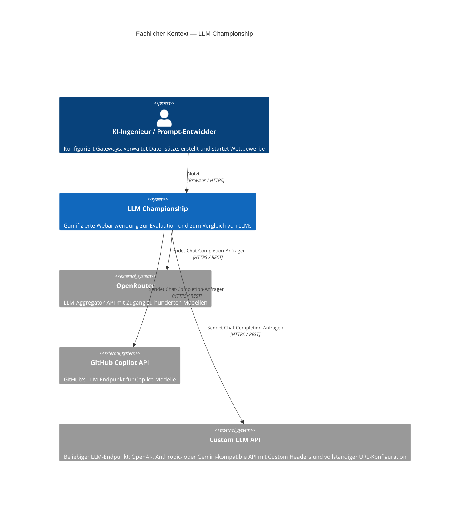

**Externe fachliche Schnittstellen:**

| Partner                         | Beschreibung                                                                                                    |
|---------------------------------|-----------------------------------------------------------------------------------------------------------------|
| LLM-Gateways (extern)          | LLM-Endpunkte in drei Formaten: OpenAI-kompatibel (`/chat/completions`), Anthropic Converse (`/converse`), Gemini (`/generateContent`); werden vom System für Evaluation und Bewertung genutzt |
| Benutzer                        | Interagiert über die Web-UI; konfiguriert Gateways, lädt Datensätze, startet Wettbewerbe, analysiert Ergebnisse  |

## 3.2 Technischer Kontext

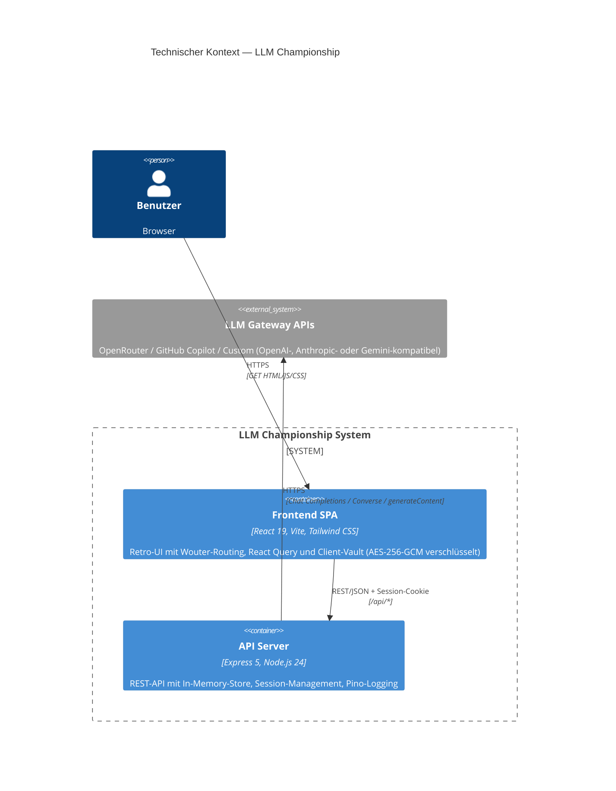

**Mapping fachlich → technisch:**

| Fachliche Schnittstelle  | Technisches Protokoll                          | Format                                |
|--------------------------|-------------------------------------------------|---------------------------------------|
| LLM-Modell-Anfragen     | HTTPS POST (format-abhängig)                    | OpenAI Chat Completion / Anthropic Converse / Gemini generateContent JSON |
| Modell-Auflistung        | HTTPS GET `/models` (nur OpenRouter/GitHub)     | OpenAI Models Response JSON (Custom-Gateways: manuelle Modellangabe) |
| Frontend ↔ Backend       | HTTPS REST `/api/*` + HttpOnly-Session-Cookie   | JSON (spezifiziert via OpenAPI 3.1)   |
| Client-Vault ↔ Backend   | HTTPS POST `/api/session/sync`                  | JSON (Gateways + Datasets)            |

---

# 4. Lösungsstrategie

| Entwurfsentscheidung                     | Begründung                                                                                                     |
|------------------------------------------|-----------------------------------------------------------------------------------------------------------------|
| **pnpm-Monorepo mit Workspaces**         | Gemeinsame Typen und Schemas werden als Pakete geteilt; Build-Orchestrierung über TypeScript-Projektverweise     |
| **OpenAPI-Spec als Kontrakt**            | Single Source of Truth; daraus werden API-Client-Hooks (React Query), Zod-Validierungsschemas und TypeScript-Typen generiert |
| **In-Memory-Store + Client-Vault**      | Kein externer Datenbank-Server nötig; Session-scoped Maps im Backend; API-Keys nur client-seitig verschlüsselt gespeichert (siehe [ADR-9](#adr-9)) |
| **JSON-Felder für Wettbewerbsergebnisse** | Flexible, variable Ergebnis-Strukturen; effiziente Speicherung verschachtelter Daten als Plain-Objects          |
| **Mehrfach-Richter-Bewertung**           | 3–5 LLM-Richter bewerten jeden Teilnehmer; Mittelwert reduziert Einzel-Bias                                     |
| **SSRF-Schutzschicht**                   | Gateway-URLs werden auf HTTPS und öffentliche IPs validiert; DNS-Auflösung wird auf private IP-Bereiche geprüft  |
| **Retro-UI-Komponentenbibliothek**       | Custom `Retro*`-Komponenten kapseln die Macintosh-System-5-Ästhetik einheitlich über alle Seiten                 |
| **React Query mit Polling**              | Automatisches Polling (2s) für laufende Wettbewerbe ermöglicht Live-Updates ohne WebSockets                      |
| **Background-Activity-System**           | Langläufige Operationen (Wettbewerbe, Dataset-Generierung) laufen async im Backend; Frontend pollt Activity-Status alle 3s und zeigt Toast-Notifications bei Abschluss; Nutzer kann frei navigieren |

---

# 5. Bausteinsicht

## 5.1 Whitebox Gesamtsystem (Ebene 1)

```mermaid
C4Container
    title Container-Diagramm — LLM Championship

    Person(user, "Benutzer", "KI-Ingenieur / Prompt-Entwickler")

    System_Boundary(monorepo, "LLM Championship Monorepo") {

        Container(frontend, \"LLM Championship Frontend\", \"React 19, Vite, TypeScript, Tailwind CSS\", \"Single Page Application mit Retro-UI (Macintosh System 5). Client-Vault (AES-256-GCM, LocalStorage). Seiten: Dashboard, Gateways, Datasets, NewCompetition, CompetitionResults, Logs\")

        Container(apiClient, "API Client React", "TypeScript, React Query, Orval", "Generierte React-Query-Hooks und Fetch-Wrapper für alle API-Endpunkte")

        Container(apiServer, \"API Server\", \"Express 5, Node.js 24, TypeScript\", \"REST-API mit Session-Management, In-Memory-Store, Routen für Gateways, Datasets, Competitions, Logs und Health. LLM-Gateway-Integration, Evaluations-Engine und automatisches LLM-Call-Logging\")

        Container(storeLib, "Store Library", "TypeScript", "In-Memory-Store mit session-scoped Maps; TypeScript-Interfaces für Gateway, Dataset, Competition")

        Container(apiZod, "API Zod Schemas", "Zod, Orval", "Generierte Zod-Validierungsschemas aus OpenAPI-Spec für alle Request/Response-Typen")

        Container(apiSpec, "API Specification", "OpenAPI 3.1 YAML", "Zentrale API-Kontraktdefinition; Quelle für Codegenerierung")
    }

    System_Ext(llmAPIs, "LLM Gateway APIs", "OpenRouter, GitHub Copilot, Custom (OpenAI/Anthropic/Gemini)")

    Rel(user, frontend, "Nutzt", "HTTPS / Browser")
    Rel(frontend, apiClient, "Importiert", "npm-Paket")
    Rel(apiClient, apiServer, "REST/JSON + Session-Cookie", "/api/*")
    Rel(apiServer, storeLib, "Importiert", "npm-Paket")
    Rel(apiServer, llmAPIs, "HTTPS", "/chat/completions, /models")
    Rel(apiSpec, apiClient, "Generiert", "Orval Codegen")
    Rel(apiSpec, apiZod, "Generiert", "Orval Codegen")

    UpdateLayoutConfig($c4ShapeInRow="3", $c4BoundaryInRow="1")
```

### Enthaltene Bausteine (Blackboxen)

| Baustein              | Verantwortung                                                                                               | Paket                        |
|-----------------------|-------------------------------------------------------------------------------------------------------------|------------------------------|
| **Frontend SPA**      | Darstellung der Retro-UI; Benutzerinteraktion; Client-Vault-Management; Zustandsverwaltung via React Query  | `@workspace/llm-championship` |
| **API Client React**  | Generierte React-Query-Hooks und Custom-Fetch-Wrapper; typsicherer API-Zugriff mit Session-Cookie           | `@workspace/api-client-react` |
| **API Server**        | REST-Endpunkte; Geschäftslogik für Gateway-Verwaltung, Dataset-Operationen, Wettbewerbs-Evaluation           | `@workspace/api-server`       |
| **Store Library**     | In-Memory-Store mit session-scoped Maps; gemeinsame Dataset-Markdown-Helfer; TypeScript-Interfaces für Gateway, Dataset, Competition | `@workspace/store`            |
| **API Zod Schemas**   | Generierte Zod-Schemas für Request/Response-Validierung                                                     | `@workspace/api-zod`          |
| **API Specification** | OpenAPI-3.1-Kontraktdefinition als YAML; Quelle für Client- und Schema-Generierung                          | `@workspace/api-spec`         |

### Wichtige Schnittstellen

| Schnittstelle          | Beschreibung                                                                                           |
|------------------------|--------------------------------------------------------------------------------------------------------|
| REST API `/api/*`      | JSON-basierte REST-API zwischen Frontend und Backend; definiert über OpenAPI-Spec; Session-Cookie für Authentifizierung |
| LLM Gateway Interface  | Multi-Format LLM-Interface: OpenAI Chat Completions, Anthropic Converse, Gemini generateContent; automatische Request/Response-Transformation je Gateway-Typ; Custom HTTP Headers und `{model}`-URL-Platzhalter für Custom-Endpunkte |
| Session-Sync           | `POST /api/session/sync` zum Restaurieren von Vault-Daten in den In-Memory-Store                       |

---

## 5.2 Ebene 2 — API Server (Whitebox)

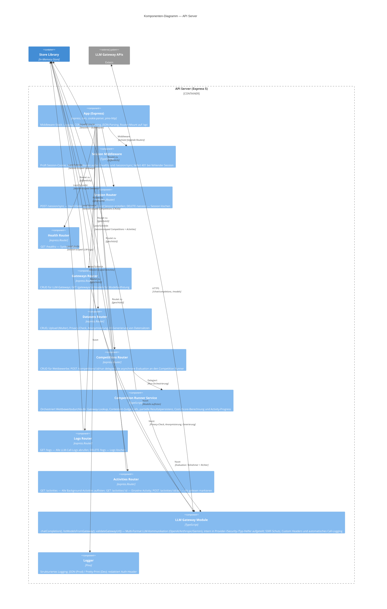

### Whitebox API Server — Komponentenbeschreibung

| Komponente              | Verantwortung                                                                                                                     |
|-------------------------|-----------------------------------------------------------------------------------------------------------------------------------|
| **App**                 | Express-Instanz; Stack: `pinoHttp` → `cors({ credentials: true })` → `cookieParser()` → `express.json (10MB)` → `express.urlencoded` → Router `/api` |
| **Session Middleware**  | Prüft HttpOnly-Cookie `sessionId`; ruft `store.touchSession()` auf; liefert 401 für ungültige Sessions; `/healthz` und `/session/sync` passieren ohne Session |
| **Session Router**      | `POST /session/sync` — erstellt Session, importiert Gateways+Datasets aus Vault; `DELETE /session` — löscht Session und Cookie    |
| **Health Router**       | `GET /healthz` → `{ status: "ok" }`                                                                                               |
| **Gateways Router**     | `GET/POST /gateways`, `DELETE /gateways/:id`, `GET /gateways/:id/models`; validiert und speichert Gateway-Konfigurationen; `GET/POST /configured-models`, `DELETE /configured-models/:id` — vorkonfigurierte Modelle mit optionalen Kosten ($/M Tokens) verwalten |
| **Datasets Router**     | `GET/POST /datasets`, `POST /datasets/upload` (Multer, 5MB, .md), `DELETE /datasets/:id`, Privacy-Check/Anonymisierung/Generierung |
| **Competitions Router** | `GET/POST /competitions`, `GET/DELETE /competitions/:id`, `POST /competitions/:id/run`; hält HTTP-Validierung und Response-Wiring schlank und delegiert die Run-Orchestrierung an den Competition Runner |
| **Competition Runner Service** | Führt Wettbewerbe aus: lädt Gateway-Mapping, ruft Contestants und Judges auf, speichert partielle Ergebnisse, aktualisiert Activities und berechnet aggregierte Kennzahlen |
| **Logs Router**         | `GET /logs` — LLM-Call-Logs der aktuellen Session abrufen (neueste zuerst); `DELETE /logs` — alle Logs löschen                    |
| **Activities Router**   | `GET /activities` — alle Background-Activities auflisten; `GET /activities/:id` — einzelne Activity; `POST /activities/:id/ack` — als gelesen markieren |
| **LLM Gateway Module**  | Zentrale LLM-Kommunikation: `chatCompletion()`, `listModelsFromGateway()`, `validateGatewayUrl()` mit SSRF-Schutz; intern in Provider-/Security-/Typ-Helfer zerlegt; Multi-Format-Support (OpenAI, Anthropic Converse, Gemini generateContent) via Provider-Mapper für Request/Response; Custom HTTP Headers; `{model}`-URL-Platzhalter; automatisches Call-Logging (Request/Response) in den Session-Store |
| **Logger**              | Pino-Logger; strukturiertes JSON-Logging in Produktion; Pretty-Print in Entwicklung; Redaktion sensibler Header                    |

---

## 5.3 Ebene 2 — Frontend SPA (Whitebox)

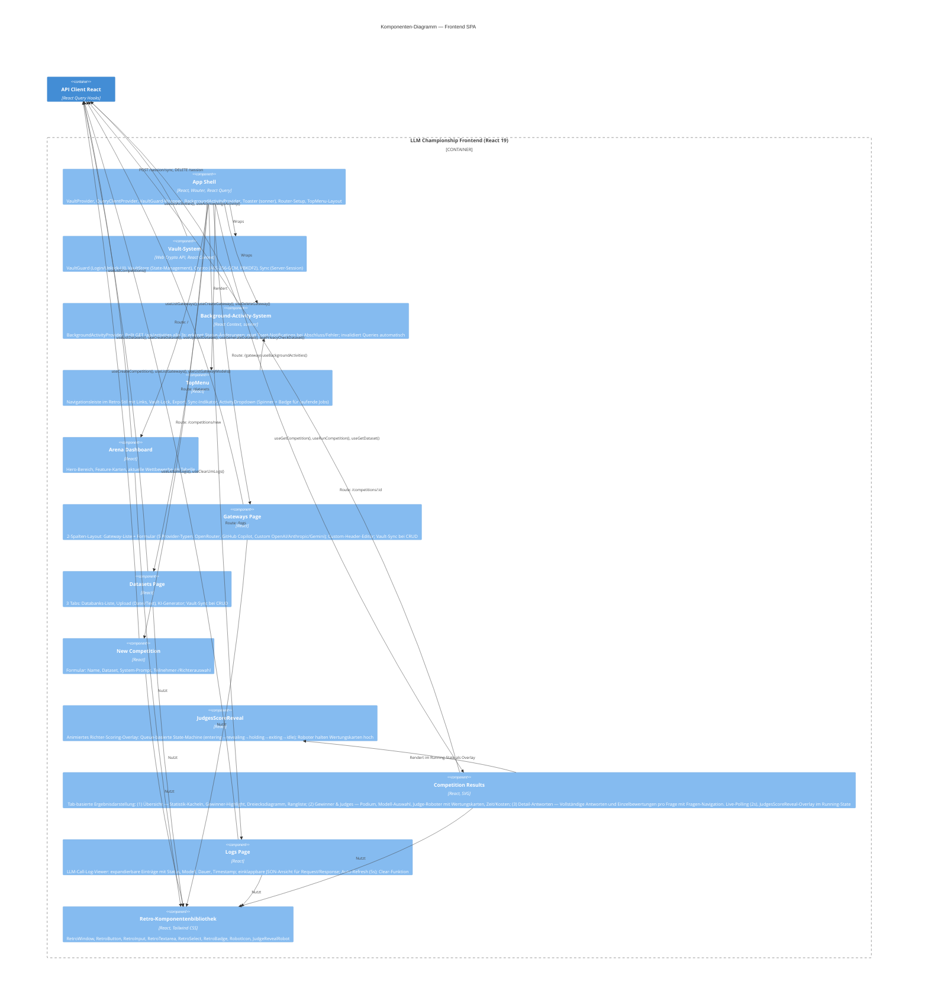

---

## 5.4 Ebene 2 — Store Library (Whitebox)

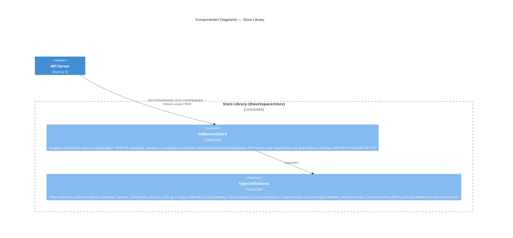

### Store Library — Datenmodell

| Interface           | Felder                                                                                                    |
|---------------------|-----------------------------------------------------------------------------------------------------------|
| **Gateway**         | `id`, `name`, `type` (openrouter/github_copilot/custom_openai/custom_anthropic/custom_gemini), `baseUrl`, `apiKey`, `customHeaders?`, `createdAt` |
| **ConfiguredModel** | `id`, `name`, `gatewayId`, `modelId`, `inputCostPerMillionTokens?`, `outputCostPerMillionTokens?`, `createdAt` |
| **Dataset**         | `id`, `name`, `content` (Markdown), `privacyStatus`, `privacyReport`, `createdAt`                        |
| **Competition**     | `id`, `name`, `datasetId`, `systemPrompt`, `status`, `contestantModels`, `judgeModels`, `results`, `createdAt` |
| **ModelSelection**  | `gatewayId`, `modelId`, `modelName`, `inputCostPerMillionTokens?`, `outputCostPerMillionTokens?`          |
| **LlmLog**          | `id`, `timestamp`, `gatewayType`, `modelId`, `requestUrl`, `requestBody`, `responseStatus`, `responseBody`, `durationMs`, `error` |
| **Activity**        | `id`, `type` (competition_run/dataset_generate), `status` (running/completed/error), `title`, `progress?`, `resultId?`, `error?`, `acknowledged`, `createdAt`, `completedAt?` |

Jede Session hat eigene Counter (`nextId`) und Maps; Sessions werden nach 2 Stunden Inaktivität automatisch bereinigt. LLM-Logs werden als Array pro Session gespeichert (max. 500 Einträge, FIFO). Activities tracken den Status langläufiger Hintergrund-Operationen und können vom Frontend als gelesen markiert werden.
Zusätzlich exportiert `@workspace/store` gemeinsame Pure Helpers zur Dataset-Markdown-Verarbeitung: Wrapping-Code-Fences werden normalisiert, Items werden konsistent über `##`-Überschriften oder Absatz-Fallback segmentiert, und bearbeitete Items werden wieder kanonisch serialisiert.

---

## 5.5 Ebene 2 — Client-Vault (Whitebox)

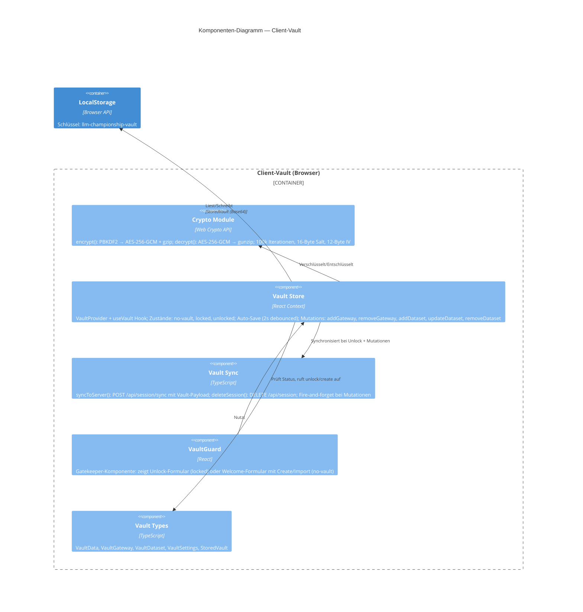

### Vault — Verschlüsselungsarchitektur

```
Klartext-JSON  →  gzip  →  AES-256-GCM verschlüsseln  →  Base64  →  LocalStorage
LocalStorage   →  Base64-Decode  →  AES-256-GCM entschlüsseln  →  gunzip  →  JSON
```

| Eigenschaft        | Wert                                        |
|--------------------|---------------------------------------------|
| Schlüsselableitung | PBKDF2, 100.000 Iterationen, SHA-256        |
| Verschlüsselung    | AES-256-GCM                                 |
| Salt               | 16 Bytes (crypto.getRandomValues)           |
| IV                 | 12 Bytes (pro Verschlüsselung neu erzeugt)  |
| Kompression        | gzip via CompressionStream/DecompressionStream |
| Speicherort        | LocalStorage, Schlüssel `llm-championship-vault` |
| Export             | `.vault`-Datei (gleiches Format)            |

---

# 6. Laufzeitsicht

## 6.1 Szenario: Vault entsperren und Session synchronisieren

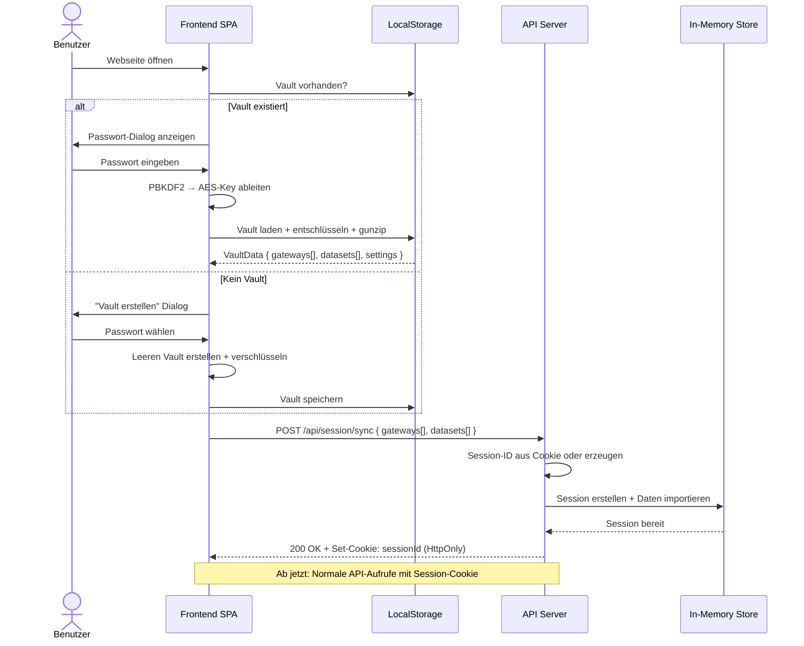

## 6.2 Szenario: Wettbewerb erstellen und durchführen

Dies ist das zentrale Nutzungsszenario — ein Benutzer erstellt einen Wettbewerb und startet die Evaluation.

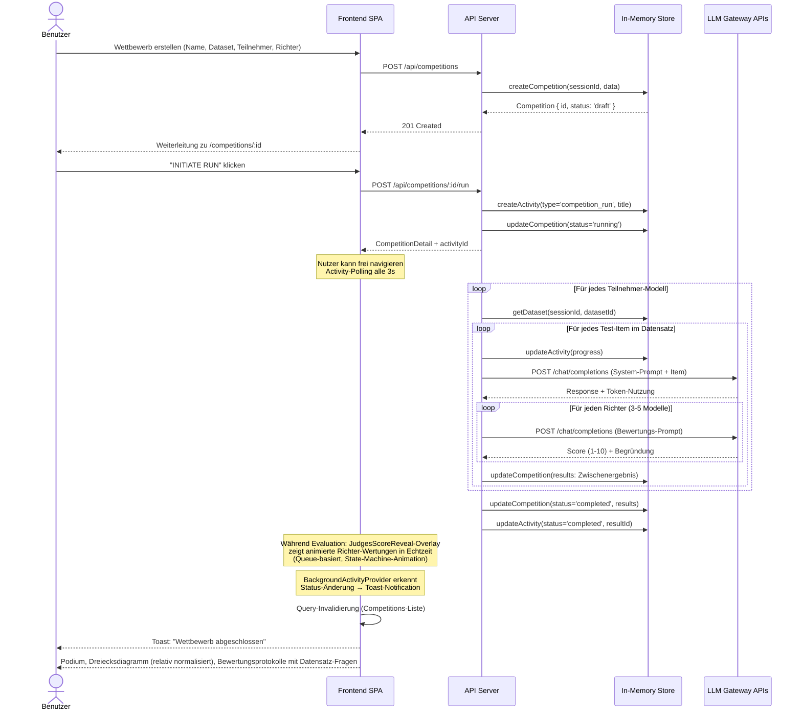

**Besonderheiten:**
- Die Evaluation läuft asynchron im API-Server; `BackgroundActivityProvider` pollt Activity-Status alle 3 Sekunden
- Zusätzlich pollt `CompetitionResults` die Competition-Daten alle 2 Sekunden für partielle Ergebnis-Updates
- `JudgesScoreReveal` erkennt neue Richter-Wertungen per `useEffect`-Diff (vorherige vs. aktuelle Response-Counts) und zeigt sie als animiertes Overlay mit Roboter-Wertungskarten
- Teilnehmer-Modelle werden mit `max concurrency = 5` parallel evaluiert
- Richter-Bewertungen laufen ebenfalls parallel (max 5)
- Zwischenergebnisse werden nach jedem Item im In-Memory-Store aktualisiert (partielle Updates)
- Activity-Progress zeigt aktuelles Modell und Item-Fortschritt (z.B. "ModelXY: item 3/10")
- Bei Fehler: Activity-Status wird auf `error` gesetzt, Toast-Notification mit Fehlermeldung
- Kostenschätzung: Verwendet die am `ConfiguredModel` hinterlegten Kosten (`inputCostPerMillionTokens`, `outputCostPerMillionTokens` in $/M Tokens); Fallback auf `$1.00/M Input`, `$2.00/M Output` wenn keine modellspezifischen Kosten konfiguriert sind

---

## 6.3 Szenario: Gateway konfigurieren und Modelle auflisten

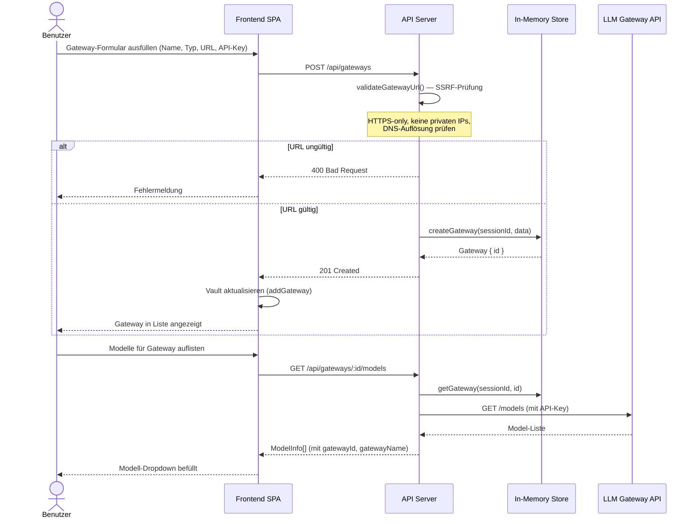

---

## 6.4 Szenario: Datensatz mit Datenschutzprüfung

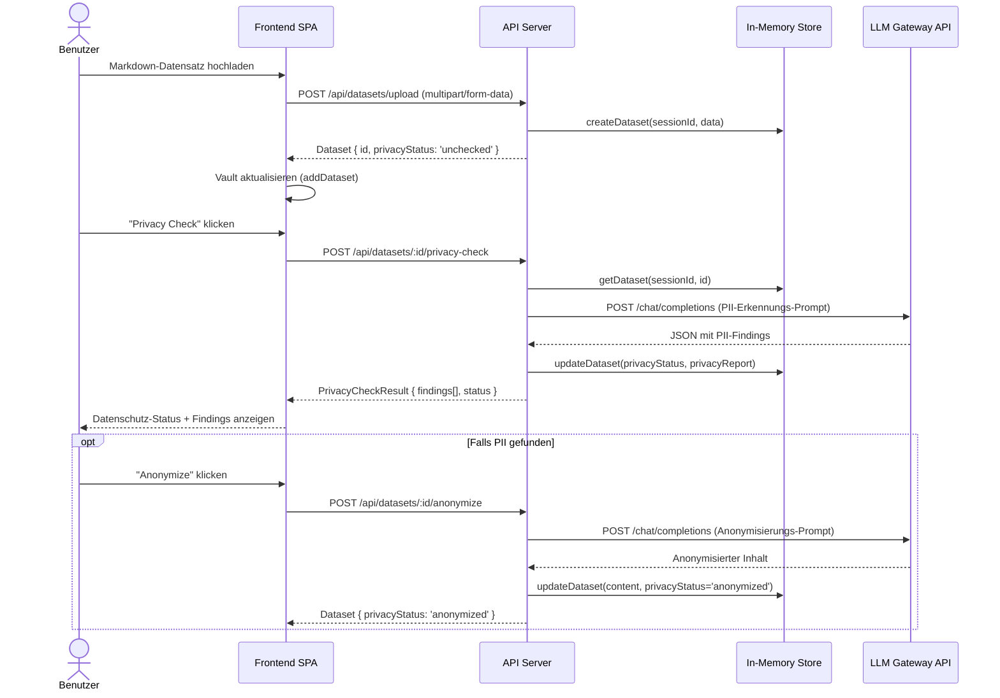

## 6.5 Szenario: Datensatz asynchron generieren

Datensatz-Generierung läuft als Background-Job; der Benutzer kann währenddessen frei navigieren.

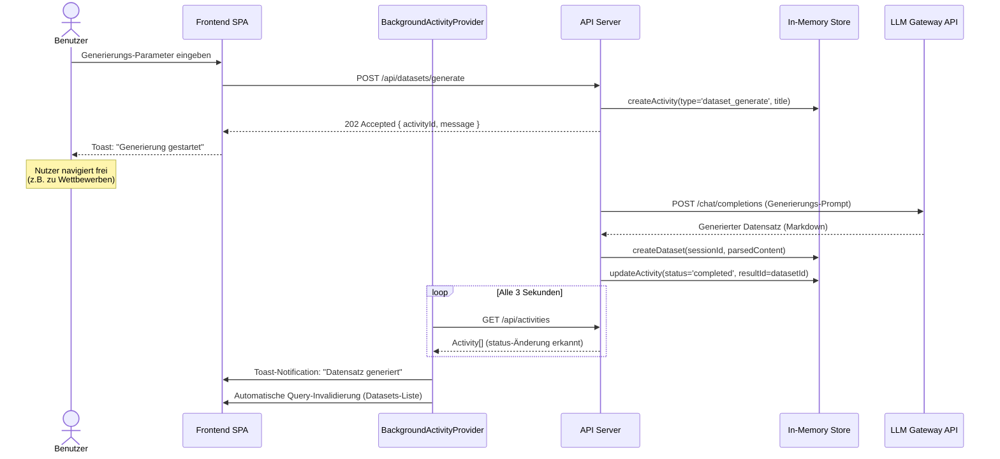

---

# 7. Verteilungssicht

## 7.1 Infrastruktur Ebene 1

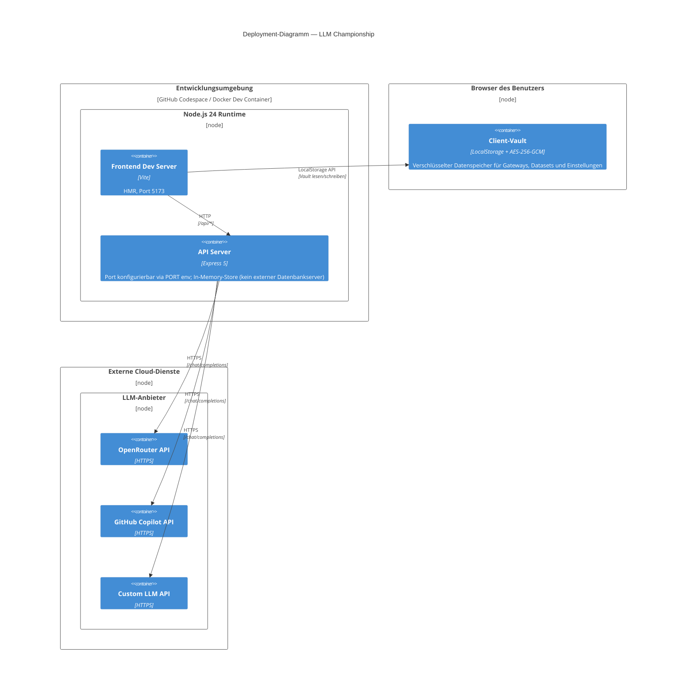

**Zuordnung von Bausteinen zu Infrastruktur:**

| Baustein               | Deployment-Ziel                | Konfiguration                              |
|------------------------|-------------------------------|--------------------------------------------|
| Frontend SPA           | Vite Dev Server (Port 5173)   | `BASE_URL`, `PORT` Umgebungsvariablen       |
| API Server             | Node.js-Prozess               | `PORT` Umgebungsvariable                    |
| Client-Vault           | Browser LocalStorage          | Passwortgeschützt (AES-256-GCM)            |
| LLM Gateway APIs       | Externe Cloud-Dienste         | Gateway-spezifische Base-URLs und API-Keys  |

---

# 8. Querschnittliche Konzepte

## 8.1 End-to-End-Typsicherheit

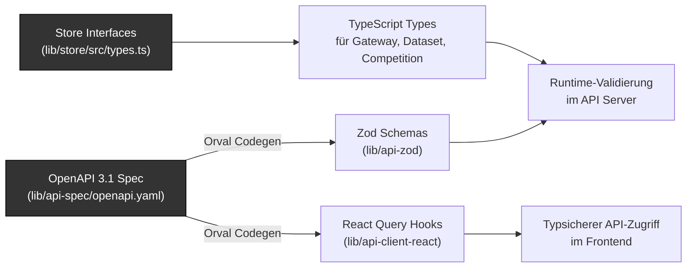

Die Typsicherheit erstreckt sich über alle Schichten:
- **API-Kontrakt** → OpenAPI 3.1 YAML als Single Source of Truth
- **Frontend** → Generierte React-Query-Hooks mit vollständigen TypeScript-Typen
- **Backend** → Plain TypeScript-Interfaces in `@workspace/store` für Typ-Definitionen
- **Validation** → Generierte Zod-Schemas für Request/Response-Validierung

## 8.2 Sicherheitskonzept

| Maßnahme                             | Beschreibung                                                                                                   |
|---------------------------------------|---------------------------------------------------------------------------------------------------------------|
| **SSRF-Schutz**                      | `validateGatewayUrl()` blockiert HTTPS-Pflicht, localhost, private IPs (RFC 1918), Link-Local, Metadata-Endpunkte |
| **DNS-Auflösung**                    | IPv4/IPv6-Auflösung wird geprüft; blockiert, wenn aufgelöste IP privat ist                                     |
| **API-Key-Schutz (Client-Vault)**    | API-Keys werden im Browser mit AES-256-GCM verschlüsselt (PBKDF2, 100k Iterationen); nur bei Session-Sync an Server übertragen; im RAM gehalten, nie persistiert |
| **Session-Cookies**                  | HttpOnly, SameSite=Strict, Path=/api, Max-Age=7200 (2h); kein JavaScript-Zugriff auf Session-ID               |
| **Header-Redaktion**                 | Pino-Logger redaktiert `authorization`- und `cookie`-Header im Logging                                         |
| **Upload-Validierung**               | Multer: max 5MB, nur `.md`-Dateien; JSON-Body: max 10MB                                                        |
| **CORS**                             | Aktiviert via `cors({ origin: true, credentials: true })` Middleware                                            |

## 8.3 LLM-Gateway-API-Formate

Das System unterstützt drei API-Formate für Custom-Gateways. Die Transformation zwischen den Formaten erfolgt im `LLM Gateway Module` über dedizierte Provider-Helfer für Request-Building und Response-Parsing.

### OpenAI-kompatibel (`custom_openai`)

| Aspekt | Details |
|--------|---------|
| **Request** | `POST {baseUrl}` mit `{ messages: [{role, content}], model, temperature }` |
| **Response-Extraktion** | Content: `choices[0].message.content`; Tokens: `usage.prompt_tokens`, `usage.completion_tokens` |
| **Beispiel-URL** | `https://api.example.com/openai/deployments/{model}/chat/completions?api-version=2024-10-21` |

### Anthropic-kompatibel (`custom_anthropic`)

| Aspekt | Details |
|--------|---------|
| **Request** | `POST {baseUrl}` mit `{ messages: [{role, content: [{text}]}], system: [{text}], inferenceConfig: {maxTokens, temperature} }` |
| **Response-Extraktion** | Content: `output.message.content[0].text`; Tokens: `usage.inputTokens`, `usage.outputTokens` |
| **Beispiel-URL** | `https://api.example.com/anthropic/model/{model}/converse` |

### Gemini-kompatibel (`custom_gemini`)

| Aspekt | Details |
|--------|---------|
| **Request** | `POST {baseUrl}` mit `{ contents: [{role, parts: [{text}]}], systemInstruction: {role, parts: [{text}]}, generationConfig: {temperature, topP, topK} }` |
| **Response-Extraktion** | Content: `candidates[0].content.parts[0].text`; Tokens: `usageMetadata.promptTokenCount`, `usageMetadata.candidatesTokenCount` |
| **Beispiel-URL** | `https://api.example.com/google/v1beta1/.../models/{model}:generateContent` |

### URL-Platzhalter und Custom Headers

- **`{model}`-Platzhalter:** Wird in der Base-URL durch `encodeURIComponent(modelId)` ersetzt
- **Custom Headers:** Beliebige Key-Value HTTP-Header pro Gateway konfigurierbar (z.B. `api-key`, `Authorization`)
- **Rückwärtskompatibilität:** Legacy-Typ `custom` wird intern als `custom_openai` behandelt
- **Kein Models-Endpunkt:** Custom-Gateways haben keinen `/models`-Endpunkt; Modelle werden manuell eingegeben

## 8.4 Datenhaltungskonzept

Das System verzichtet bewusst auf eine externe Datenbank (siehe [ADR-9](#adr-9)):

| Datentyp        | Client (Browser)                 | Server (Node.js)              | Begründung                                     |
|-----------------|----------------------------------|-------------------------------|-------------------------------------------------|
| **Gateways**    | Vault (AES-256-GCM verschlüsselt) | In-Memory (Session-Map)      | Enthält apiKey → muss verschlüsselt sein       |
| **Datasets**    | Vault (gzip-komprimiert)         | In-Memory (Session-Map)       | Können groß sein → Kompression spart Platz     |
| **Competitions** | —                               | In-Memory (Session-Map)       | Kurzlebig, laufende Evaluationen               |
| **Settings**    | Vault                            | —                             | Benutzereinstellungen, UI-Präferenzen          |

**Session-Lifecycle:** Sessions werden nach 2 Stunden Inaktivität automatisch bereinigt (Cleanup-Timer alle 5 Minuten). Der Client-Vault ist die primäre Datenquelle — ein Server-Neustart erfordert lediglich einen erneuten Session-Sync.

## 8.5 Retro-UI-Designsystem

Das UI folgt konsequent der **Macintosh System 5 Ästhetik** (ca. 1985):

| Element              | Umsetzung                                                                |
|----------------------|--------------------------------------------------------------------------|
| **Farbpalette**      | 1-bit Monochrom (Schwarz/Weiß) mit Dithering-Mustern                    |
| **Schriftarten**     | Silkscreen (Pixel-Font) für Überschriften; System-Monospace für Text     |
| **Fenster**          | `RetroWindow`: 3px Border, Titelleiste mit gestreiftem Hintergrund |
| **Buttons**          | `RetroButton`: Press-Effekt (translate), Varianten: primary/secondary/danger |
| **Formulare**        | `RetroInput`, `RetroTextarea`, `RetroSelect` mit 3px-Border und Focus-Ring |
| **Badges**           | `RetroBadge`: Inline mit Border, Uppercase, Letter-Spacing               |
| **Dreiecksdiagramm** | `TriangleChart`: SVG-basierter Ternary-Plot mit baryzentrischen Koordinaten; 3 Ecken (Qualität, Tempo, Effizienz); relative Normalisierung (1–10) anhand Min/Max aller Modelle (Speed/Cost invertiert: bester Wert → 10); Modelle als unterschiedliche Marker (Kreis, Quadrat, Raute, Dreieck, Kreuz); Gitterlinien bei 25%/50%/75%; Hover-Tooltip mit Z-Ordering |
| **Fensterinhalt**        | `RetroWindow` rendert stets einen klar abgegrenzten Content-Bereich unter der Titelleiste; Schließen erfolgt optional über einen dedizierten Close-Button |
| **Richter-Scoring-Overlay** | `JudgesScoreReveal`: Animiertes Overlay während laufender Wettbewerbe; `JudgeRevealRobot`-Komponenten mit CSS-Transition-Reveal und `animate-score-pop` (Bounce-Keyframe `scale 0.7→1.15→0.95→1`); absolut positioniert unter der Header-Bar (z-40); Queue-System (max. 4 Events) |

## 8.6 Fehlerbehandlung

| Schicht     | Strategie                                                                                                |
|-------------|----------------------------------------------------------------------------------------------------------|
| **Frontend** | `ApiError<T>` und `ResponseParseError` Klassen im Custom-Fetch; React-Query-Retry (1x)                 |
| **Backend**  | Express-Error-Handling; spezifische HTTP-Statuscodes (400, 401, 404, 500); Pino-Logging für alle Fehler  |
| **LLM**     | Timeout-Behandlung; Fehler bei LLM-Aufrufen werden als Wettbewerbs-Status `error` gespeichert            |
| **Session**  | 401-Response bei fehlender/ungültiger Session; Client initiiert automatisch Session-Sync                 |

## 8.7 Logging und Monitoring

- **Pino** als strukturierter Logger (JSON in Produktion, Pretty-Print in Entwicklung)
- **pino-http** Middleware für automatisches Request/Response-Logging
- Request-Serialisierung: nur `id`, `method`, `url` (ohne Query-Params)
- Response-Serialisierung: nur `statusCode`
- Sensible Daten (`authorization`, `cookie`) werden automatisch redaktiert
- **LLM-Call-Logging:** Jeder `chatCompletion()`-Aufruf wird automatisch im session-scoped In-Memory-Store geloggt (Request-Body, Response-Body, Status, Dauer, Fehler). Logs sind über `GET /api/logs` abrufbar und über die Logs-Seite im Frontend einsehbar. Pro Session werden maximal 500 Logs gespeichert (älteste werden verworfen). Die Logs-Seite bietet expandierbare Einträge mit einklappbarer, pretty-printed JSON-Ansicht und Auto-Refresh (5 Sekunden).

## 8.8 Background-Activity-Management

Langläufige Operationen (Wettbewerb-Evaluation, Datensatz-Generierung) werden als **Background Activities** verwaltet, damit der Benutzer die Anwendung frei weiternutzen kann.

**Backend-Pattern:**
- Bei Start einer langläufigen Operation wird ein `Activity`-Objekt im In-Memory-Store erstellt (`status: 'running'`)
- Der Endpunkt antwortet sofort (z.B. `202 Accepted`) und führt die Operation asynchron fort
- Fortschritt wird im Activity-Objekt aktualisiert (`progress`-Feld, z.B. "ModelXY: item 3/10")
- Bei Abschluss: `status: 'completed'`, `resultId` verweist auf das Ergebnis (Competition/Dataset-ID)
- Bei Fehler: `status: 'error'`, `error`-Feld enthält die Fehlermeldung
- REST-Endpunkte: `GET /api/activities` (alle), `GET /api/activities/:id` (einzeln), `POST /api/activities/:id/ack` (Kenntnisnahme)

**Frontend-Pattern:**
- `BackgroundActivityProvider` (React Context) pollt `GET /api/activities` alle 3 Sekunden
- Vergleicht vorherigen mit aktuellem Zustand; erkennt Statusänderungen (running → completed/error)
- Feuert **sonner**-Toast-Notifications bei Statuswechsel
- Automatische **Query-Invalidierung** (TanStack React Query) für betroffene Ressourcen (Datasets, Competitions)
- `ActivityDropdown` in der `TopMenu`-Leiste zeigt laufende/abgeschlossene Activities mit Badge-Counter
- Benutzer kann einzelne Activities als „zur Kenntnis genommen" markieren (`acknowledge`)

---

# 9. Architekturentscheidungen

| # | Entscheidung                           | Kontext & Alternativen                                                                                   | Begründung                                                                           |
|---|----------------------------------------|----------------------------------------------------------------------------------------------------------|--------------------------------------------------------------------------------------|
| 1 | **Express 5** als Backend-Framework    | Alternativen: Fastify, Hono, NestJS                                                                     | Weit verbreiteter Standard; minimaler Overhead; gute Middleware-Ökosystem             |
| 2 | **Wouter** statt React Router          | Alternative: React Router v6, TanStack Router                                                             | Minimalistische API (~1.5kB); ausreichend für die benötigte Routing-Komplexität       |
| 3 | **React Query + Polling** statt WebSockets | Alternative: Socket.io, Server-Sent Events                                                            | Einfacher zu implementieren; zustandsloses Backend; ausreichend für 2s-Updates        |
| 4 | **Orval Codegenerierung**             | Alternativen: openapi-typescript, swagger-codegen                                                         | Generiert React-Query-Hooks + Zod-Schemas direkt aus OpenAPI-Spec                    |
| 5 | **pnpm-Workspaces** als Monorepo-Tool | Alternativen: Nx, Turborepo, Lerna                                                                       | Leichtgewichtig; native Workspace-Unterstützung; schnelle Installation via Hardlinks  |
| 6 | **esbuild** für Backend-Build          | Alternativen: tsc, swc, tsx                                                                              | Extrem schnelle Builds; CJS-Bundles für Node.js-Kompatibilität                       |
| 7 | **Web Crypto API** für Vault           | Alternativen: Stanford JS Crypto Library, TweetNaCl                                                      | Native Browser-API; kein zusätzliches Bundle; AES-256-GCM + PBKDF2 nativ unterstützt  |
| 8 | **HttpOnly-Session-Cookie**            | Alternativen: JWT in Authorization-Header, Bearer-Token in LocalStorage                                   | Automatisch bei jedem Request; kein JavaScript-Zugriff; SameSite-Schutz gegen CSRF   |
| 10 | **Dreiecksdiagramm statt Radar-Chart** | Alternative: Recharts RadarChart                                                                          | Ternary-Plot bildet das Spannungsfeld Speed/Cost/Quality direkt ab; reines SVG ohne externe Lib; klarere Positionierung der Modelle via baryzentrische Koordinaten |
| 11 | **Tab-basierte Competition-Results** | Alternative: Einzelseite mit Scroll-Sektionen, Multi-Page-Routing                                          | 3 Tabs (Übersicht/Gewinner & Judges/Detail-Antworten) reduzieren kognitive Last; alle Daten aus einem API-Call (`useGetCompetition`); Tab-State als lokaler React-State statt URL-Routing |
| 12 | **Drei Custom-Gateway-Typen** statt eines generischen | Alternative: Einzelner `custom`-Typ mit manueller Format-Konfiguration                          | Explizite Typen (`custom_openai`, `custom_anthropic`, `custom_gemini`) ermöglichen automatische Request/Response-Transformation; weniger Fehlkonfiguration; klare UI-Führung mit typ-spezifischen URL-Platzhaltern |

<a id="adr-9"></a>

## ADR-9: In-Memory-Store + Client-Vault statt PostgreSQL

### Status

Akzeptiert (März 2026)

### Kontext

Die ursprüngliche Architektur verwendete **PostgreSQL** mit **Drizzle ORM** als persistente Datenbank. Alle Gateways, Datasets und Competitions wurden serverseitig in relationalen Tabellen gespeichert. API-Keys wurden im Klartext in der `gateways`-Tabelle persistiert.

Diese Architektur brachte folgende Herausforderungen:

1. **Infrastruktur-Abhängigkeit:** PostgreSQL musste als zusätzlicher Dienst bereitgestellt, konfiguriert und gewartet werden. In Entwicklungsumgebungen (Codespaces, Dev Container) erhöhte dies die Komplexität.
2. **API-Key-Sicherheit:** API-Keys lagen im Klartext in der Datenbank — ein Single Point of Compromise. Jeder, der Zugriff auf die DB oder ein Backup hatte, konnte alle Keys lesen.
3. **Überflüssige Persistenz:** Die Anwendung ist ein Einzel-Nutzer-Werkzeug zur LLM-Evaluation. Langfristige Datenpersistenz über Server-Neustarts hinaus hat geringen Mehrwert, da Wettbewerbsergebnisse kurzlebig und reproduzierbar sind.
4. **Deployment-Vereinfachung:** Ohne externe Datenbank kann die Anwendung als einzelner Node.js-Prozess deployt werden.

### Entscheidung

PostgreSQL und Drizzle ORM wurden vollständig entfernt. Stattdessen:

- **Backend:** Ein leichtgewichtiger **In-Memory-Store** (`@workspace/store`) ersetzt die Datenbank. Daten werden in session-scoped `Map`-Objekten gehalten. Sessions werden über HttpOnly-Cookies identifiziert und nach 2 Stunden Inaktivität automatisch bereinigt.
- **Frontend:** Ein verschlüsselter **Client-Vault** im Browser-LocalStorage speichert Gateways (inkl. API-Keys) und Datasets. Verschlüsselung via Web Crypto API (PBKDF2 → AES-256-GCM) mit nutzergewähltem Passwort. Der Vault kann als `.vault`-Datei exportiert/importiert werden.
- **Synchronisation:** Beim Entsperren des Vaults sendet der Client die Daten via `POST /api/session/sync` an den Server. Der Server erstellt eine Session und importiert die Daten in den In-Memory-Store.

### Konsequenzen

**Positiv:**
- Kein externer Datenbank-Server nötig → vereinfachtes Deployment und Entwicklung
- API-Keys nur client-seitig verschlüsselt gespeichert → deutlich bessere Sicherheitspostur
- Schnellere Datenzugriffe (RAM statt SQL-Queries)
- Kein ORM, keine Migrationen, kein Connection-Pool-Management

**Negativ:**
- Datenverlust bei Server-Neustart → Client-Vault ist primäre Quelle; Re-Sync nötig
- Kein Multi-User-Support → jede Session hat eigene isolierte Daten
- Keine Volltextsuche oder komplexe Queries auf den Daten
- LocalStorage-Limit (~5-10 MB) begrenzt die Vault-Größe → gzip-Kompression mildert das

**Entfernte Komponenten:** `lib/db/` (Drizzle ORM, pg Pool, Schema-Definitionen), `drizzle-orm`, `drizzle-zod`, `pg`, `drizzle-kit`, `DATABASE_URL` Umgebungsvariable.

---

# 10. Qualitätsanforderungen

## 10.1 Übersicht der Qualitätsanforderungen

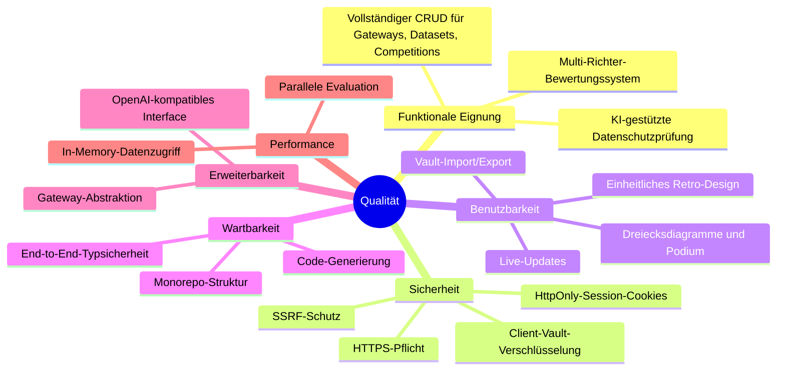

## 10.2 Qualitätsszenarien

| ID   | Qualitätsmerkmal | Szenario                                                                                                     | Erwartetes Ergebnis                                      |
|------|------------------|--------------------------------------------------------------------------------------------------------------|----------------------------------------------------------|
| QS-1 | Erweiterbarkeit  | Ein neuer LLM-Anbieter mit beliebiger API (OpenAI-, Anthropic- oder Gemini-kompatibel) soll eingebunden werden | Nur Gateway-Konfiguration über UI nötig (Typ, URL, Custom Headers), kein Code-Change |
| QS-2 | Sicherheit       | Ein Benutzer versucht, eine Gateway-URL auf `http://169.254.169.254` zu setzen                                | System lehnt mit Fehlermeldung ab                         |
| QS-3 | Benutzbarkeit    | Ein Benutzer startet einen Wettbewerb mit 3 Teilnehmern und 3 Richtern                                       | Live-Statusanzeige; Ergebnisse nach Abschluss auf Podium  |
| QS-4 | Typsicherheit    | Ein Entwickler ändert die OpenAPI-Spec und generiert den Client neu                                           | TypeScript-Compilerfehler zeigen alle Anpassungsstellen    |
| QS-5 | Datenschutz      | Ein Datensatz mit personenbezogenen Daten wird hochgeladen                                                    | Privacy-Check erkennt PII; Anonymisierung ersetzt Daten    |
| QS-6 | Datensicherheit  | Der Server wird neu gestartet während ein Benutzer arbeitet                                                    | Vault-Daten bleiben im Browser erhalten; Re-Sync stellt Session wieder her |

---

# 11. Risiken und technische Schulden

| #  | Risiko / Technische Schuld                        | Beschreibung                                                                                                  | Mögliche Maßnahme                                          |
|----|---------------------------------------------------|---------------------------------------------------------------------------------------------------------------|-------------------------------------------------------------|
| R1 | **Manuelle Kostenpflege**                         | Modellspezifische Kosten (`$/M Tokens`) müssen manuell bei der Modellkonfiguration eingegeben werden; sie werden nicht automatisch von der Gateway-API (z.B. OpenRouter `/models` Pricing) synchronisiert. Bei Preisänderungen seitens des Anbieters stimmen die hinterlegten Kosten nicht mehr. | Automatischer Abgleich der Preise mit der OpenRouter-Pricing-API; periodischer Hintergrund-Sync; Warnung bei veralteten Preisen |
| R2 | **Kein Authentifizierungssystem**                 | Die Anwendung hat aktuell kein User-Login oder Autorisierung; Sessions sind anonym                             | Auth-Middleware einführen (z.B. OAuth2, JWT)                 |
| R3 | **Polling statt Push**                            | 2-Sekunden-Polling erzeugt unnötige Last; bei vielen gleichzeitigen Nutzern skaliert dies schlecht             | SSE oder WebSockets für Echtzeit-Updates                     |
| R4 | **Keine Rate-Limiting**                           | API-Endpunkte sind nicht gegen Missbrauch geschützt                                                            | Rate-Limiting-Middleware (z.B. express-rate-limit)           |
| R5 | **Datenverlust bei Server-Neustart**              | In-Memory-Daten (inkl. laufender Wettbewerbe) gehen bei Server-Neustart verloren                               | Client-Vault als primäre Quelle; optionale File-Persistenz  |
| R6 | **Backend-Integrationsabdeckung unvollständig** | Frontend-Unit-Tests sowie direkte Runner- und Gateway-Helfertests sind vorhanden, aber Routen-Fehlerpfade und vollständige End-to-End-Flows sind noch nicht ausreichend automatisiert abgesichert | Gezielte Vitest-/Integrationstests für Route-, Session- und verbleibende Activity-Flows ergänzen |
| R7 | **Abhängigkeit von externen LLM-Anbietern**      | Verfügbarkeit und Preisänderungen der LLM-APIs liegen außerhalb der Kontrolle                                  | Fallback-Gateway, Caching, Retry-Strategien                  |
| R8 | **LocalStorage-Limit**                           | Client-Vault ist auf ~5-10 MB begrenzt; sehr große Datasets können das Limit erreichen                         | Gzip-Kompression (bereits implementiert); IndexedDB als Alternative |
| R9 | **Konfigurierte Modelle nicht im Vault persistiert** | `ConfiguredModel`-Objekte (inkl. Kosten) werden nur im In-Memory-Store gehalten und gehen bei Session-Ablauf oder Server-Neustart verloren; sie sind nicht Teil des verschlüsselten Client-Vaults | ConfiguredModels in `VaultData` aufnehmen und beim Session-Sync mit übertragen |
| R10 | **Fallback-Kosten bei fehlender Konfiguration** | Wenn keine modellspezifischen Kosten hinterlegt sind, greift ein fester Fallback ($1/M Input, $2/M Output). Dieser Wert ist für teure Modelle (z.B. GPT-4, Claude Opus) deutlich zu niedrig und für günstige Modelle zu hoch — die Kostenauswertung wird dadurch verzerrt. | Pflichtfeld für Kosten bei Modellkonfiguration; oder automatisches Abrufen von Pricing-Daten aus der Gateway-API |

---

# 12. Glossar

| Begriff                  | Definition                                                                                                        |
|--------------------------|-------------------------------------------------------------------------------------------------------------------|
| **Gateway**              | Konfigurierte Verbindung zu einem LLM-Anbieter (OpenRouter, GitHub Copilot oder Custom-Endpunkt mit OpenAI-, Anthropic- oder Gemini-kompatibler API). Custom-Gateways unterstützen benutzerdefinierte HTTP-Headers und vollständige URL-Konfiguration mit `{model}`-Platzhalter |
| **Dataset**              | Markdown-formatierter Testdatensatz; optionale äußere Markdown-Code-Fences werden normalisiert, die Aufteilung in Items erfolgt konsistent über `##`-Überschriften oder Absatz-Fallback |
| **Competition**          | Wettbewerb, in dem mehrere Teilnehmer-Modelle (Contestants) von Richter-Modellen (Judges) bewertet werden           |
| **Configured Model**     | Vorkonfiguriertes Modell mit Gateway-Zuordnung, Anzeigename und optionalen Kosteninformationen (Input/Output $/M Tokens); wird bei der Wettbewerbs-Erstellung als Vorlage genutzt |
| **Contestant Model**     | LLM-Modell, das als Teilnehmer in einem Wettbewerb antworten generiert                                             |
| **Judge Model**          | LLM-Modell, das als Richter die Antworten der Teilnehmer mit einem Score (1-10) bewertet                           |
| **Privacy Check**        | KI-gestützte Analyse eines Datensatzes auf personenbezogene Informationen (PII)                                     |
| **Anonymisierung**       | KI-gestützter Prozess, PII in Datensätzen durch synthetische Daten zu ersetzen                                      |
| **System Prompt**        | Vorangestellte Anweisung an das LLM, die den Kontext und die gewünschte Verhaltensweise definiert                   |
| **SSRF**                 | Server-Side Request Forgery — Angriffsvektor, bei dem der Server zu Anfragen an interne Ressourcen verleitet wird    |
| **Client-Vault**         | Verschlüsselter Datenspeicher im Browser-LocalStorage; enthält Gateways (inkl. API-Keys) und Datasets; Verschlüsselung via AES-256-GCM mit nutzergewähltem Passwort |
| **In-Memory-Store**      | Session-scoped Datenspeicher im Server-RAM; ersetzt die externe Datenbank; Maps für Gateways, Datasets, Competitions |
| **Session-Sync**         | Prozess, bei dem der Client beim Vault-Entsperren die Daten an den Server sendet (`POST /api/session/sync`), um eine Server-Session zu erstellen |
| **Orval**                | Code-Generator, der aus OpenAPI-Specs TypeScript-Clients (React Query Hooks) und Zod-Schemas erzeugt               |
| **React Query**          | Bibliothek für serverseitigen Zustandsmanagement in React; Caching, Refetching, Mutations                           |
| **Wouter**               | Minimalistischer React-Router (~1.5kB); Alternative zu React Router                                                 |
| **Retro-UI**             | UI-Designsystem im Stil des Macintosh System 5 (ca. 1985): 1-bit Monochrom, Pixel-Fonts, Dithering                 |
| **JudgesScoreReveal**    | Animiertes Overlay-Fenster, das während laufender Wettbewerbe Richter-Wertungen visualisiert: Roboter halten Wertungskarten hoch; Queue-basierte State-Machine-Animation (entering→revealing→holding→exiting→idle) |
| **Relative Normalisierung** | Bewertungsmethode im Dreiecksdiagramm: Scores werden relativ zum besten/schlechtesten Modell auf 1–10 skaliert (statt absoluter Werte); Speed und Cost invertiert |
| **Activity**             | Background-Job-Tracking-Objekt mit Status (`running`/`completed`/`error`), Fortschritt und Ergebnis-Referenz         |
| **Background Job**       | Langläufige Operation (Wettbewerb-Evaluation, Datensatz-Generierung), die asynchron im Backend läuft und über eine Activity getrackt wird |
