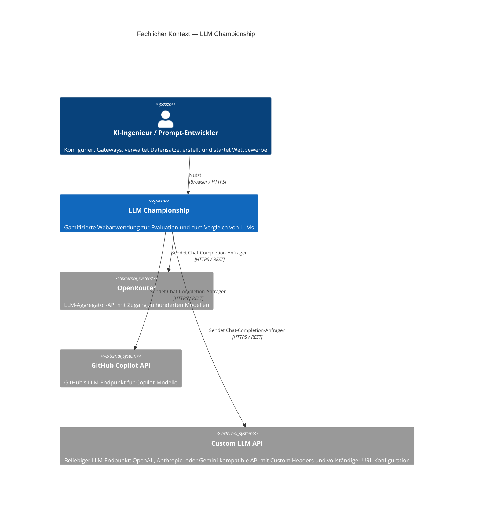
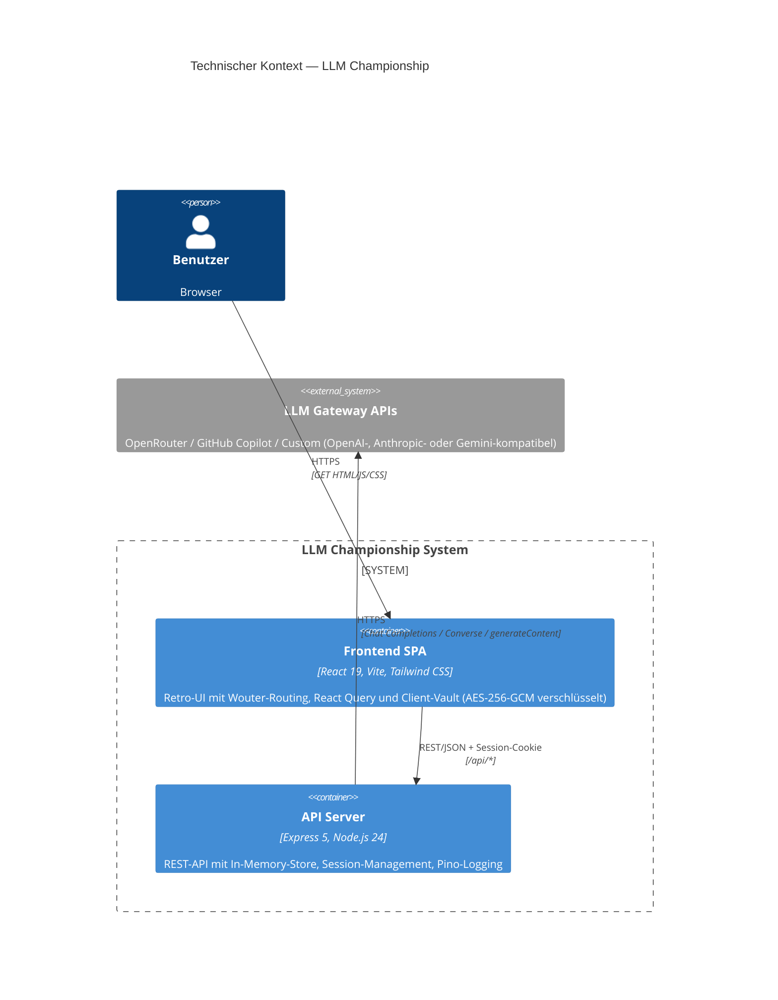

# 3. Kontextabgrenzung

## 3.1 Fachlicher Kontext

**Externe fachliche Schnittstellen:**

| Partner                         | Beschreibung                                                                                                    |
|---------------------------------|-----------------------------------------------------------------------------------------------------------------|
| LLM-Gateways (extern)          | LLM-Endpunkte in drei Formaten: OpenAI-kompatibel (`/chat/completions`), Anthropic Converse (`/converse`), Gemini (`/generateContent`); werden vom System für Evaluation und Bewertung genutzt |
| Benutzer                        | Interagiert über die Web-UI; konfiguriert Gateways, lädt Datensätze, startet Wettbewerbe, analysiert Ergebnisse  |

## 3.2 Technischer Kontext

**Mapping fachlich → technisch:**

| Fachliche Schnittstelle  | Technisches Protokoll                          | Format                                |
|--------------------------|-------------------------------------------------|---------------------------------------|
| LLM-Modell-Anfragen     | HTTPS POST (format-abhängig)                    | OpenAI Chat Completion / Anthropic Converse / Gemini generateContent JSON |
| Modell-Auflistung        | HTTPS GET `/models` (nur OpenRouter/GitHub)     | OpenAI Models Response JSON (Custom-Gateways: manuelle Modellangabe) |
| Frontend ↔ Backend       | HTTPS REST `/api/*` + HttpOnly-Session-Cookie   | JSON (spezifiziert via OpenAPI 3.1)   |
| Client-Vault ↔ Backend   | HTTPS POST `/api/session/sync`                  | JSON (Gateways + Datasets)            |

---