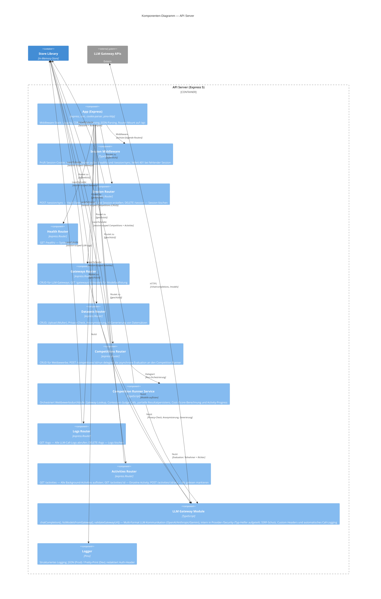
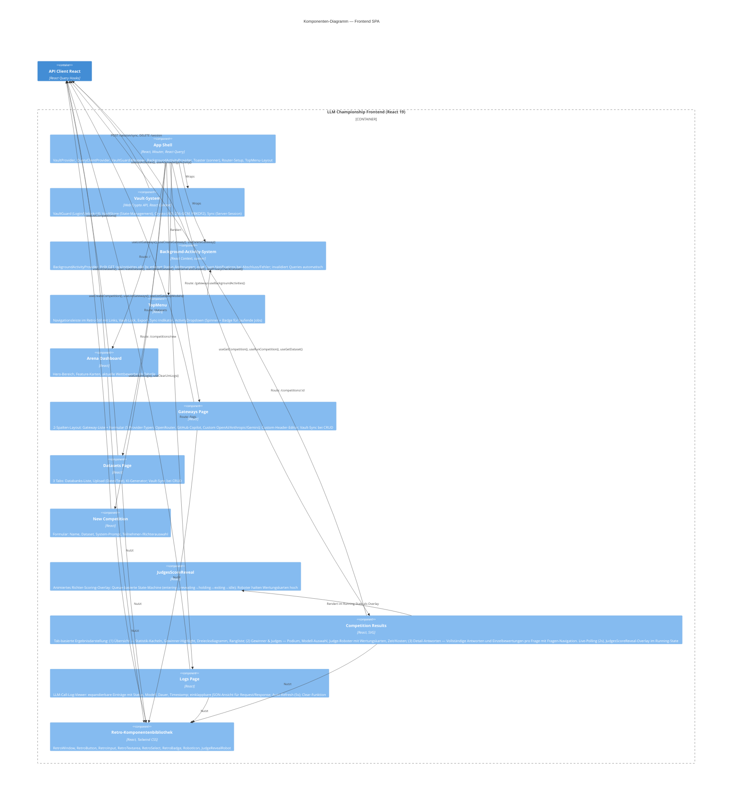
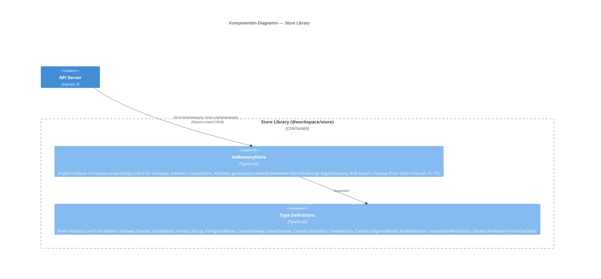
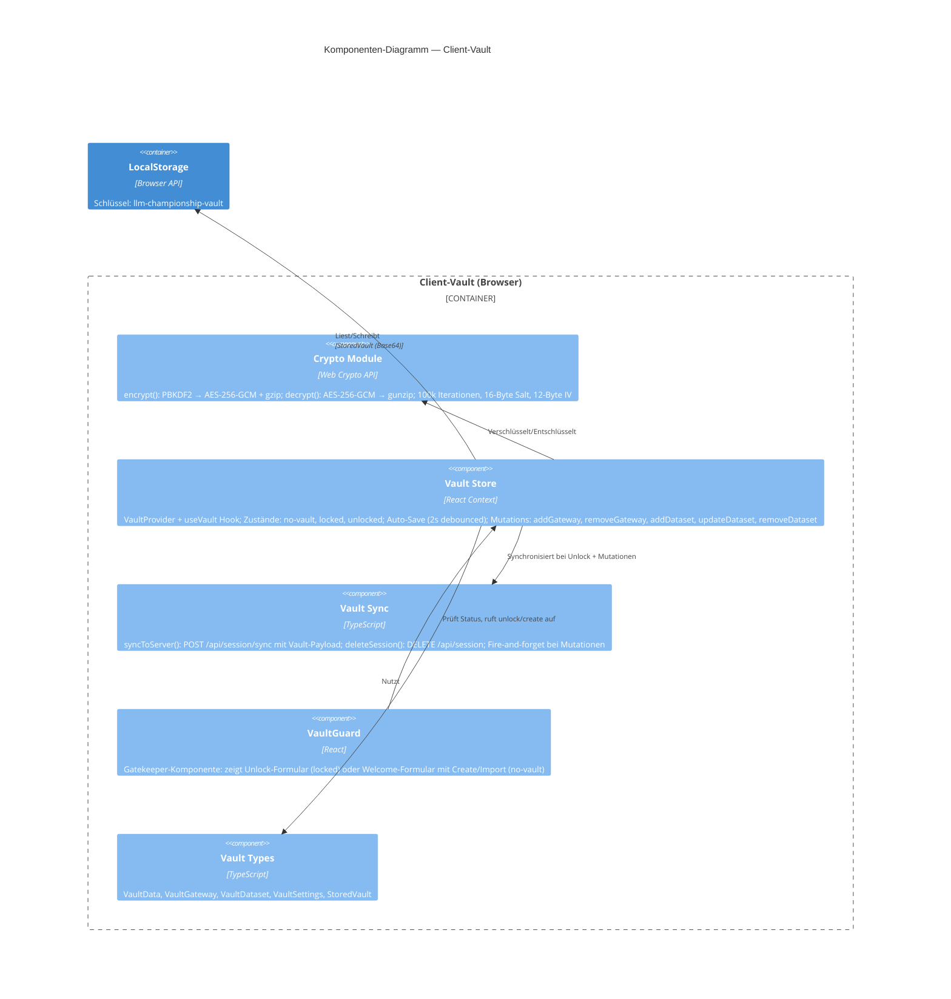

# 5. Bausteinsicht

## 5.1 Whitebox Gesamtsystem (Ebene 1)

```mermaid
C4Container
    title Container-Diagramm — LLM Championship

    Person(user, "Benutzer", "KI-Ingenieur / Prompt-Entwickler")

    System_Boundary(monorepo, "LLM Championship Monorepo") {

        Container(frontend, \"LLM Championship Frontend\", \"React 19, Vite, TypeScript, Tailwind CSS\", \"Single Page Application mit Retro-UI (Macintosh System 5). Client-Vault (AES-256-GCM, LocalStorage). Seiten: Dashboard, Gateways, Datasets, NewCompetition, CompetitionResults, Logs\")

        Container(apiClient, "API Client React", "TypeScript, React Query, Orval", "Generierte React-Query-Hooks und Fetch-Wrapper für alle API-Endpunkte")

        Container(apiServer, \"API Server\", \"Express 5, Node.js 24, TypeScript\", \"REST-API mit Session-Management, In-Memory-Store, Routen für Gateways, Datasets, Competitions, Logs und Health. LLM-Gateway-Integration, Evaluations-Engine und automatisches LLM-Call-Logging\")

        Container(storeLib, "Store Library", "TypeScript", "In-Memory-Store mit session-scoped Maps; TypeScript-Interfaces für Gateway, Dataset, Competition")

        Container(apiZod, "API Zod Schemas", "Zod, Orval", "Generierte Zod-Validierungsschemas aus OpenAPI-Spec für alle Request/Response-Typen")

        Container(apiSpec, "API Specification", "OpenAPI 3.1 YAML", "Zentrale API-Kontraktdefinition; Quelle für Codegenerierung")
    }

    System_Ext(llmAPIs, "LLM Gateway APIs", "OpenRouter, GitHub Copilot, Custom (OpenAI/Anthropic/Gemini)")

    Rel(user, frontend, "Nutzt", "HTTPS / Browser")
    Rel(frontend, apiClient, "Importiert", "npm-Paket")
    Rel(apiClient, apiServer, "REST/JSON + Session-Cookie", "/api/*")
    Rel(apiServer, storeLib, "Importiert", "npm-Paket")
    Rel(apiServer, llmAPIs, "HTTPS", "/chat/completions, /models")
    Rel(apiSpec, apiClient, "Generiert", "Orval Codegen")
    Rel(apiSpec, apiZod, "Generiert", "Orval Codegen")

    UpdateLayoutConfig($c4ShapeInRow="3", $c4BoundaryInRow="1")
```

### Enthaltene Bausteine (Blackboxen)

| Baustein              | Verantwortung                                                                                               | Paket                        |
|-----------------------|-------------------------------------------------------------------------------------------------------------|------------------------------|
| **Frontend SPA**      | Darstellung der Retro-UI; Benutzerinteraktion; Client-Vault-Management; Zustandsverwaltung via React Query  | `@workspace/llm-championship` |
| **API Client React**  | Generierte React-Query-Hooks und Custom-Fetch-Wrapper; typsicherer API-Zugriff mit Session-Cookie           | `@workspace/api-client-react` |
| **API Server**        | REST-Endpunkte; Geschäftslogik für Gateway-Verwaltung, Dataset-Operationen, Wettbewerbs-Evaluation           | `@workspace/api-server`       |
| **Store Library**     | In-Memory-Store mit session-scoped Maps; gemeinsame Dataset-Markdown-Helfer; TypeScript-Interfaces für Gateway, Dataset, Competition | `@workspace/store`            |
| **API Zod Schemas**   | Generierte Zod-Schemas für Request/Response-Validierung                                                     | `@workspace/api-zod`          |
| **API Specification** | OpenAPI-3.1-Kontraktdefinition als YAML; Quelle für Client- und Schema-Generierung                          | `@workspace/api-spec`         |

### Wichtige Schnittstellen

| Schnittstelle          | Beschreibung                                                                                           |
|------------------------|--------------------------------------------------------------------------------------------------------|
| REST API `/api/*`      | JSON-basierte REST-API zwischen Frontend und Backend; definiert über OpenAPI-Spec; Session-Cookie für Authentifizierung |
| LLM Gateway Interface  | Multi-Format LLM-Interface: OpenAI Chat Completions, Anthropic Converse, Gemini generateContent; automatische Request/Response-Transformation je Gateway-Typ; Custom HTTP Headers und `{model}`-URL-Platzhalter für Custom-Endpunkte |
| Session-Sync           | `POST /api/session/sync` zum Restaurieren von Vault-Daten in den In-Memory-Store                       |

---

## 5.2 Ebene 2 — API Server (Whitebox)



### Whitebox API Server — Komponentenbeschreibung

| Komponente              | Verantwortung                                                                                                                     |
|-------------------------|-----------------------------------------------------------------------------------------------------------------------------------|
| **App**                 | Express-Instanz; Stack: `pinoHttp` → `cors({ credentials: true })` → `cookieParser()` → `express.json (10MB)` → `express.urlencoded` → Router `/api` |
| **Session Middleware**  | Prüft HttpOnly-Cookie `sessionId`; ruft `store.touchSession()` auf; liefert 401 für ungültige Sessions; `/healthz` und `/session/sync` passieren ohne Session |
| **Session Router**      | `POST /session/sync` — erstellt Session, importiert Gateways+Datasets aus Vault; `DELETE /session` — löscht Session und Cookie    |
| **Health Router**       | `GET /healthz` → `{ status: "ok" }`                                                                                               |
| **Gateways Router**     | `GET/POST /gateways`, `DELETE /gateways/:id`, `GET /gateways/:id/models`; validiert und speichert Gateway-Konfigurationen; `GET/POST /configured-models`, `DELETE /configured-models/:id` — vorkonfigurierte Modelle mit optionalen Kosten ($/M Tokens) verwalten |
| **Datasets Router**     | `GET/POST /datasets`, `POST /datasets/upload` (Multer, 5MB, .md), `DELETE /datasets/:id`, Privacy-Check/Anonymisierung/Generierung |
| **Competitions Router** | `GET/POST /competitions`, `GET/DELETE /competitions/:id`, `POST /competitions/:id/run`; hält HTTP-Validierung und Response-Wiring schlank und delegiert die Run-Orchestrierung an den Competition Runner |
| **Competition Runner Service** | Führt Wettbewerbe aus: lädt Gateway-Mapping, ruft Contestants und Judges auf, speichert partielle Ergebnisse, aktualisiert Activities und berechnet aggregierte Kennzahlen |
| **Logs Router**         | `GET /logs` — LLM-Call-Logs der aktuellen Session abrufen (neueste zuerst); `DELETE /logs` — alle Logs löschen                    |
| **Activities Router**   | `GET /activities` — alle Background-Activities auflisten; `GET /activities/:id` — einzelne Activity; `POST /activities/:id/ack` — als gelesen markieren |
| **LLM Gateway Module**  | Zentrale LLM-Kommunikation: `chatCompletion()`, `listModelsFromGateway()`, `validateGatewayUrl()` mit SSRF-Schutz; intern in Provider-/Security-/Typ-Helfer zerlegt; Multi-Format-Support (OpenAI, Anthropic Converse, Gemini generateContent) via Provider-Mapper für Request/Response; Custom HTTP Headers; `{model}`-URL-Platzhalter; automatisches Call-Logging (Request/Response) in den Session-Store |
| **Logger**              | Pino-Logger; strukturiertes JSON-Logging in Produktion; Pretty-Print in Entwicklung; Redaktion sensibler Header                    |

---

## 5.3 Ebene 2 — Frontend SPA (Whitebox)



---

## 5.4 Ebene 2 — Store Library (Whitebox)



### Store Library — Datenmodell

| Interface           | Felder                                                                                                    |
|---------------------|-----------------------------------------------------------------------------------------------------------|
| **Gateway**         | `id`, `name`, `type` (openrouter/github_copilot/custom_openai/custom_anthropic/custom_gemini), `baseUrl`, `apiKey`, `customHeaders?`, `createdAt` |
| **ConfiguredModel** | `id`, `name`, `gatewayId`, `modelId`, `inputCostPerMillionTokens?`, `outputCostPerMillionTokens?`, `createdAt` |
| **Dataset**         | `id`, `name`, `content` (Markdown), `privacyStatus`, `privacyReport`, `createdAt`                        |
| **Competition**     | `id`, `name`, `datasetId`, `systemPrompt`, `status`, `contestantModels`, `judgeModels`, `results`, `createdAt` |
| **ModelSelection**  | `gatewayId`, `modelId`, `modelName`, `inputCostPerMillionTokens?`, `outputCostPerMillionTokens?`          |
| **LlmLog**          | `id`, `timestamp`, `gatewayType`, `modelId`, `requestUrl`, `requestBody`, `responseStatus`, `responseBody`, `durationMs`, `error` |
| **Activity**        | `id`, `type` (competition_run/dataset_generate), `status` (running/completed/error), `title`, `progress?`, `resultId?`, `error?`, `acknowledged`, `createdAt`, `completedAt?` |

Jede Session hat eigene Counter (`nextId`) und Maps; Sessions werden nach 2 Stunden Inaktivität automatisch bereinigt. LLM-Logs werden als Array pro Session gespeichert (max. 500 Einträge, FIFO). Activities tracken den Status langläufiger Hintergrund-Operationen und können vom Frontend als gelesen markiert werden.
Zusätzlich exportiert `@workspace/store` gemeinsame Pure Helpers zur Dataset-Markdown-Verarbeitung: Wrapping-Code-Fences werden normalisiert, Items werden konsistent über `##`-Überschriften oder Absatz-Fallback segmentiert, und bearbeitete Items werden wieder kanonisch serialisiert.

---

## 5.5 Ebene 2 — Client-Vault (Whitebox)



### Vault — Verschlüsselungsarchitektur

```
Klartext-JSON  →  gzip  →  AES-256-GCM verschlüsseln  →  Base64  →  LocalStorage
LocalStorage   →  Base64-Decode  →  AES-256-GCM entschlüsseln  →  gunzip  →  JSON
```

| Eigenschaft        | Wert                                        |
|--------------------|---------------------------------------------|
| Schlüsselableitung | PBKDF2, 100.000 Iterationen, SHA-256        |
| Verschlüsselung    | AES-256-GCM                                 |
| Salt               | 16 Bytes (crypto.getRandomValues)           |
| IV                 | 12 Bytes (pro Verschlüsselung neu erzeugt)  |
| Kompression        | gzip via CompressionStream/DecompressionStream |
| Speicherort        | LocalStorage, Schlüssel `llm-championship-vault` |
| Export             | `.vault`-Datei (gleiches Format)            |

---