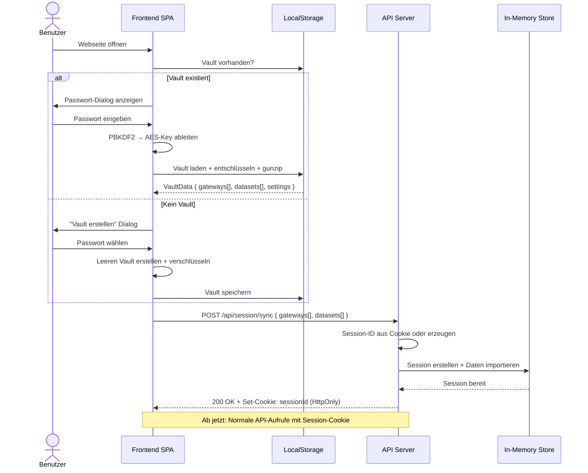
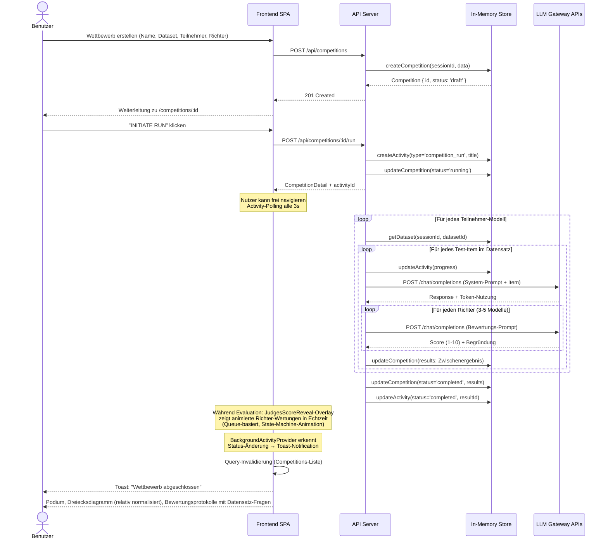
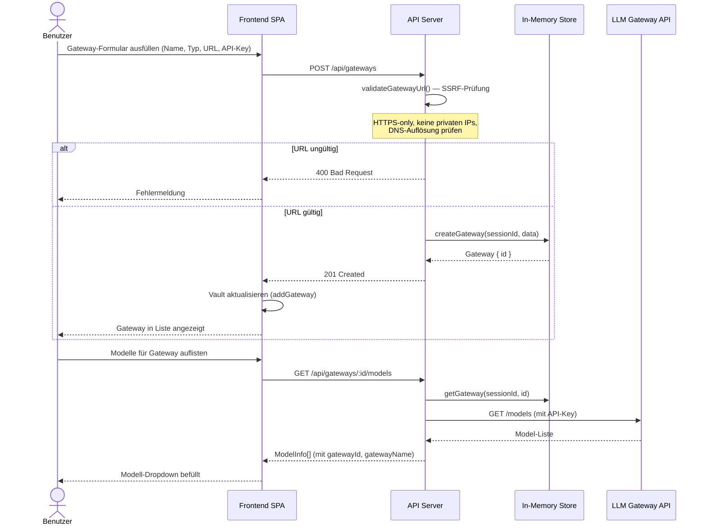
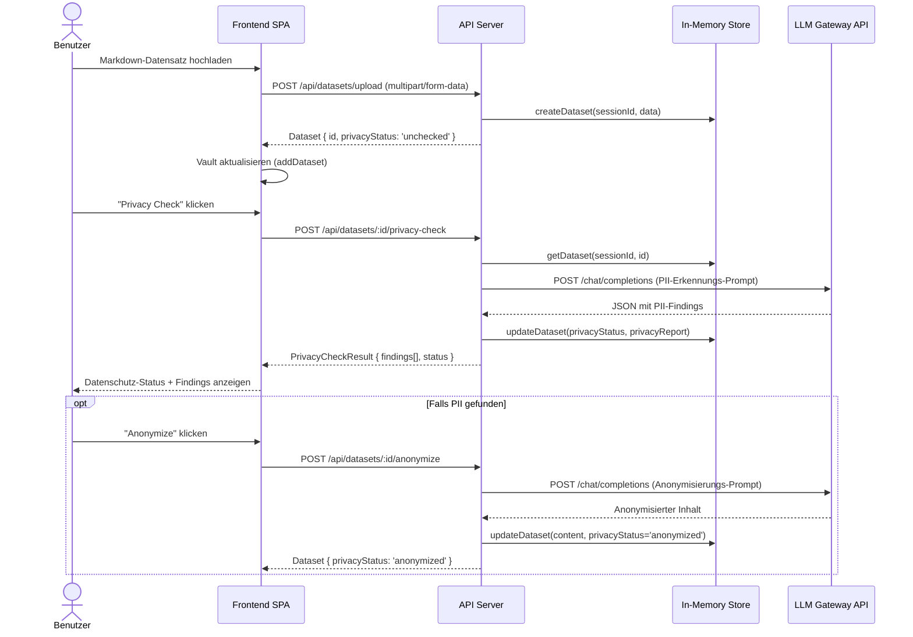
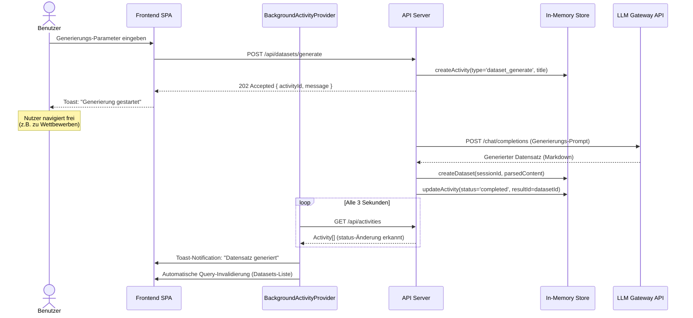

# 6. Laufzeitsicht

## 6.1 Szenario: Vault entsperren und Session synchronisieren

## 6.2 Szenario: Wettbewerb erstellen und durchführen

Dies ist das zentrale Nutzungsszenario — ein Benutzer erstellt einen Wettbewerb und startet die Evaluation.

**Besonderheiten:**
- Die Evaluation läuft asynchron im API-Server; `BackgroundActivityProvider` pollt Activity-Status alle 3 Sekunden
- Zusätzlich pollt `CompetitionResults` die Competition-Daten alle 2 Sekunden für partielle Ergebnis-Updates
- `JudgesScoreReveal` erkennt neue Richter-Wertungen per `useEffect`-Diff (vorherige vs. aktuelle Response-Counts) und zeigt sie als animiertes Overlay mit Roboter-Wertungskarten
- Teilnehmer-Modelle werden mit `max concurrency = 5` parallel evaluiert
- Richter-Bewertungen laufen ebenfalls parallel (max 5)
- Zwischenergebnisse werden nach jedem Item im In-Memory-Store aktualisiert (partielle Updates)
- Activity-Progress zeigt aktuelles Modell und Item-Fortschritt (z.B. "ModelXY: item 3/10")
- Bei Fehler: Activity-Status wird auf `error` gesetzt, Toast-Notification mit Fehlermeldung
- Kostenschätzung: Verwendet die am `ConfiguredModel` hinterlegten Kosten (`inputCostPerMillionTokens`, `outputCostPerMillionTokens` in $/M Tokens); Fallback auf `$1.00/M Input`, `$2.00/M Output` wenn keine modellspezifischen Kosten konfiguriert sind

---

## 6.3 Szenario: Gateway konfigurieren und Modelle auflisten

---

## 6.4 Szenario: Datensatz mit Datenschutzprüfung

## 6.5 Szenario: Datensatz asynchron generieren

Datensatz-Generierung läuft als Background-Job; der Benutzer kann währenddessen frei navigieren.

---