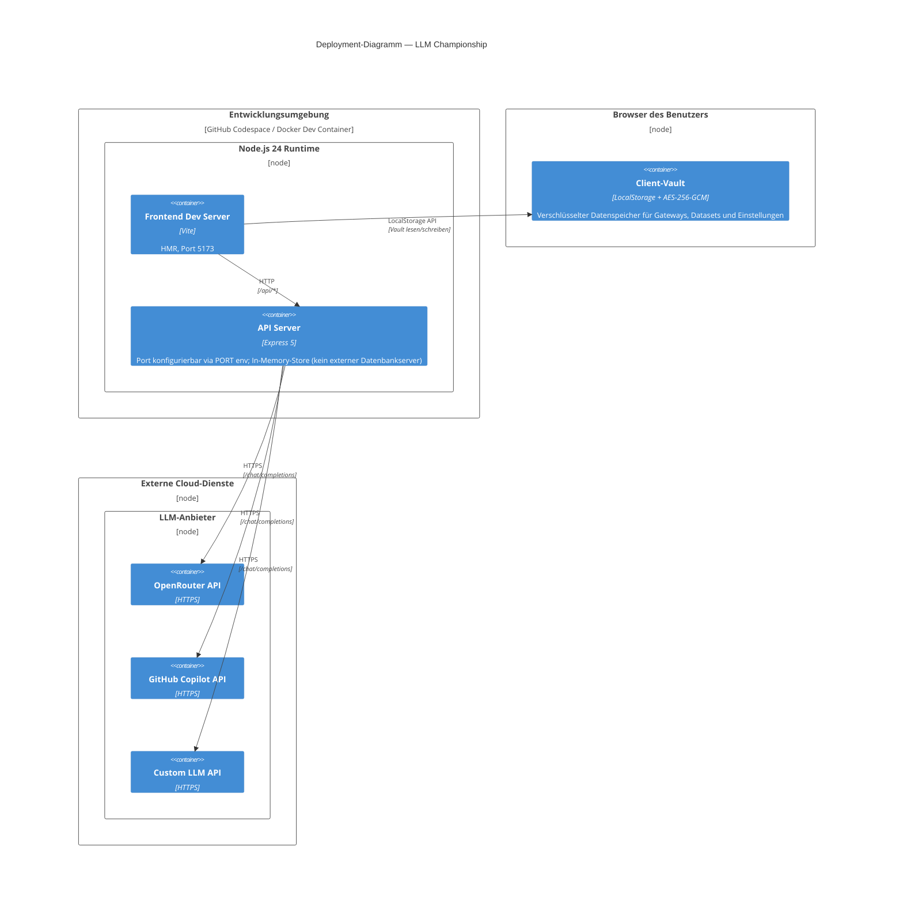

# 7. Verteilungssicht

## 7.1 Infrastruktur Ebene 1

**Zuordnung von Bausteinen zu Infrastruktur:**

| Baustein               | Deployment-Ziel                | Konfiguration                              |
|------------------------|-------------------------------|--------------------------------------------|
| Frontend SPA           | Vite Dev Server (Port 5173)   | `BASE_URL`, `PORT` Umgebungsvariablen       |
| API Server             | Node.js-Prozess               | `PORT` Umgebungsvariable                    |
| Client-Vault           | Browser LocalStorage          | Passwortgeschützt (AES-256-GCM)            |
| LLM Gateway APIs       | Externe Cloud-Dienste         | Gateway-spezifische Base-URLs und API-Keys  |

---