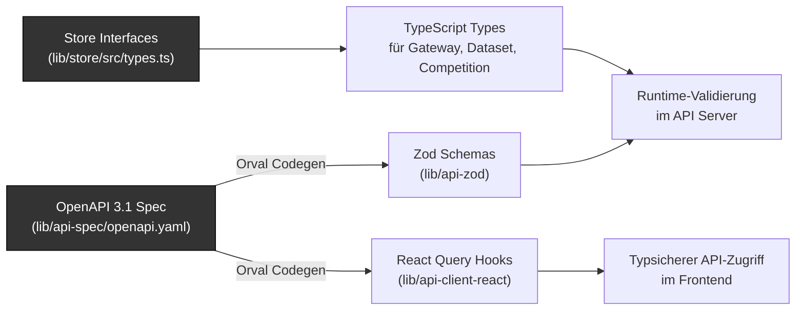

# 8. Querschnittliche Konzepte

## 8.1 End-to-End-Typsicherheit



Die Typsicherheit erstreckt sich über alle Schichten:
- **API-Kontrakt** → OpenAPI 3.1 YAML als Single Source of Truth
- **Frontend** → Generierte React-Query-Hooks mit vollständigen TypeScript-Typen
- **Backend** → Plain TypeScript-Interfaces in `@workspace/store` für Typ-Definitionen
- **Validation** → Generierte Zod-Schemas für Request/Response-Validierung

## 8.2 Sicherheitskonzept

| Maßnahme                             | Beschreibung                                                                                                   |
|---------------------------------------|---------------------------------------------------------------------------------------------------------------|
| **SSRF-Schutz**                      | `validateGatewayUrl()` blockiert HTTPS-Pflicht, localhost, private IPs (RFC 1918), Link-Local, Metadata-Endpunkte |
| **DNS-Auflösung**                    | IPv4/IPv6-Auflösung wird geprüft; blockiert, wenn aufgelöste IP privat ist                                     |
| **API-Key-Schutz (Client-Vault)**    | API-Keys werden im Browser mit AES-256-GCM verschlüsselt (PBKDF2, 100k Iterationen); nur bei Session-Sync an Server übertragen; im RAM gehalten, nie persistiert |
| **Session-Cookies**                  | HttpOnly, SameSite=Strict, Path=/api, Max-Age=7200 (2h); kein JavaScript-Zugriff auf Session-ID               |
| **Header-Redaktion**                 | Pino-Logger redaktiert `authorization`- und `cookie`-Header im Logging                                         |
| **Upload-Validierung**               | Multer: max 5MB, nur `.md`-Dateien; JSON-Body: max 10MB                                                        |
| **CORS**                             | Aktiviert via `cors({ origin: true, credentials: true })` Middleware                                            |

## 8.3 LLM-Gateway-API-Formate

Das System unterstützt drei API-Formate für Custom-Gateways. Die Transformation zwischen den Formaten erfolgt im `LLM Gateway Module` über dedizierte Provider-Helfer für Request-Building und Response-Parsing.

### OpenAI-kompatibel (`custom_openai`)

| Aspekt | Details |
|--------|---------|
| **Request** | `POST {baseUrl}` mit `{ messages: [{role, content}], model, temperature }` |
| **Response-Extraktion** | Content: `choices[0].message.content`; Tokens: `usage.prompt_tokens`, `usage.completion_tokens` |
| **Beispiel-URL** | `https://api.example.com/openai/deployments/{model}/chat/completions?api-version=2024-10-21` |

### Anthropic-kompatibel (`custom_anthropic`)

| Aspekt | Details |
|--------|---------|
| **Request** | `POST {baseUrl}` mit `{ messages: [{role, content: [{text}]}], system: [{text}], inferenceConfig: {maxTokens, temperature} }` |
| **Response-Extraktion** | Content: `output.message.content[0].text`; Tokens: `usage.inputTokens`, `usage.outputTokens` |
| **Beispiel-URL** | `https://api.example.com/anthropic/model/{model}/converse` |

### Gemini-kompatibel (`custom_gemini`)

| Aspekt | Details |
|--------|---------|
| **Request** | `POST {baseUrl}` mit `{ contents: [{role, parts: [{text}]}], systemInstruction: {role, parts: [{text}]}, generationConfig: {temperature, topP, topK} }` |
| **Response-Extraktion** | Content: `candidates[0].content.parts[0].text`; Tokens: `usageMetadata.promptTokenCount`, `usageMetadata.candidatesTokenCount` |
| **Beispiel-URL** | `https://api.example.com/google/v1beta1/.../models/{model}:generateContent` |

### URL-Platzhalter und Custom Headers

- **`{model}`-Platzhalter:** Wird in der Base-URL durch `encodeURIComponent(modelId)` ersetzt
- **Custom Headers:** Beliebige Key-Value HTTP-Header pro Gateway konfigurierbar (z.B. `api-key`, `Authorization`)
- **Rückwärtskompatibilität:** Legacy-Typ `custom` wird intern als `custom_openai` behandelt
- **Kein Models-Endpunkt:** Custom-Gateways haben keinen `/models`-Endpunkt; Modelle werden manuell eingegeben

## 8.4 Datenhaltungskonzept

Das System verzichtet bewusst auf eine externe Datenbank (siehe [ADR-9](09-architekturentscheidungen.md#adr-9)):

| Datentyp        | Client (Browser)                 | Server (Node.js)              | Begründung                                     |
|-----------------|----------------------------------|-------------------------------|-------------------------------------------------|
| **Gateways**    | Vault (AES-256-GCM verschlüsselt) | In-Memory (Session-Map)      | Enthält apiKey → muss verschlüsselt sein       |
| **Datasets**    | Vault (gzip-komprimiert)         | In-Memory (Session-Map)       | Können groß sein → Kompression spart Platz     |
| **Competitions** | —                               | In-Memory (Session-Map)       | Kurzlebig, laufende Evaluationen               |
| **Settings**    | Vault                            | —                             | Benutzereinstellungen, UI-Präferenzen          |

**Session-Lifecycle:** Sessions werden nach 2 Stunden Inaktivität automatisch bereinigt (Cleanup-Timer alle 5 Minuten). Der Client-Vault ist die primäre Datenquelle — ein Server-Neustart erfordert lediglich einen erneuten Session-Sync.

## 8.5 Retro-UI-Designsystem

Das UI folgt konsequent der **Macintosh System 5 Ästhetik** (ca. 1985). Das gesamte Designsystem basiert auf dem Prinzip der **strikten 1-Bit-Beschränkung**: Ausschließlich Schwarz und Weiß — kein `opacity`, keine `rgba`-Werte, keine Halbtöne. Grautöne werden ausschließlich durch CSS-Dithering-Muster abgebildet.

### CSS-Architektur

Der Stylecode ist in vier thematische Dateien aufgeteilt (`artifacts/llm-championship/src/styles/`):

| Datei | Zweck |
|-------|-------|
| `theme.css` | **Einzige Quelle für alle Design-Tokens** — zwei Primärfarben + semantische Aliase. Diese Datei austauschen = gesamte App neu einfärben. |
| `patterns.css` | Dithering-Muster als Tailwind-Utilities. Alle Muster nutzen `var(--color-mac-black)` / `var(--color-mac-white)` — keine hardcodierten Farbwerte. |
| `base.css` | Body, h1–h6, Scrollbar, Selection-Styles |
| `utilities.css` | `.retro-shadow`, `.title-stripes`, `.scanlines`, Animationen (`blink`, `score-pop`) |

### Theme-Token-System

Das Theme basiert auf genau **zwei CSS Custom Properties**, aus denen alle anderen Tokens abgeleitet werden:

```css
/* theme.css — @theme inline */
--color-mac-black: #000;
--color-mac-white: #fff;

/* Alle semantischen Aliase verweisen auf diese zwei Variablen */
--color-background:         var(--color-mac-white);
--color-foreground:         var(--color-mac-black);
--color-primary:            var(--color-mac-black);
--color-primary-foreground: var(--color-mac-white);
/* … */
```

Tailwind CSS v4 mit `@theme inline` kompiliert alle Utility-Klassen als `var(--color-mac-black)` statt als Literal `#000`. Das ermöglicht **Runtime-Theme-Switching** ohne Rebuild.

### Dithering-Muster (Ersatz für Grautöne)

Statt `bg-mac-black/50` oder `rgba(0,0,0,0.5)` werden CSS-Gradienten-Muster verwendet:

| Klasse | Dichte | Technik |
|--------|--------|---------|
| `.bg-pattern-5` | ~5% | `radial-gradient`, 6px-Gitter |
| `.bg-pattern-12` | ~12% | 4×8px Bayer-Dither |
| `.bg-pattern-25` | 25% | 4px Bayer-Dither |
| `.bg-dither` | 50% | Schachbrettmuster |
| `.bg-dither-lines` | ~50% | Horizontale Linien |
| `.bg-pattern-75` | 75% | Invertiertes Schachbrettmuster |

Eigene Muster können als Drop-in in `patterns.css` eingetragen werden (z. B. von [Crankit GFXP](https://dev.crankit.app/tools/gfxp/)).

### Theme überschreiben

**Build-time** via Vite-Env-Variablen (`.env.local`):
```env
VITE_COLOR_BLACK=#1a1a2e
VITE_COLOR_WHITE=#e8e8e0
```

**Runtime** via JavaScript:
```ts
document.documentElement.style.setProperty("--color-mac-black", "#2d1b69");
document.documentElement.style.setProperty("--color-mac-white", "#f0e6ff");
```

Das Bootstrapping in `src/main.tsx` liest die Vite-Variablen direkt beim App-Start und setzt sie vor dem ersten Render auf `:root`.

### Komponenten-Bibliothek

Die Retro-Komponenten sind in zwei Unterverzeichnisse strukturiert:

**`src/components/ui/`** — Interaktive UI-Bausteine:

| Komponente | Verantwortung |
|------------|---------------|
| `RetroWindow` | Container mit Titelleiste (`.title-stripes`), optionalem Close-Button, `retro-shadow` |
| `RetroButton` | Press-Effekt (`active:translate-y-1`); Varianten: `primary`/`secondary`/`danger`; `disabled`: Dither-Muster statt opacity |
| `RetroInput` / `RetroTextarea` | 3px Border, Focus-Ring; `placeholder:text-mac-black` |
| `RetroSelect` | Native `<select>` mit reinem SVG-Chevron (`currentColor`) — kein `backgroundImage`-Inline-Style |
| `RetroCombobox` | Durchsuchbares Dropdown; ausgewählter Eintrag: `bg-pattern-12`; Disabled: `bg-pattern-25 border-dashed` |
| `RetroBadge` | Inline-Label mit Border, Uppercase |
| `RetroDialog` | Modal mit `bg-dither`-Backdrop |
| `RetroFormField` | Label + Input-Wrapper |
| `RetroProgressBar` | Fortschrittsbalken; offener Bereich: `bg-pattern-75` |
| `RetroError` | Gestrichelter Fehlerrahmen |

**`src/components/icons/`** — SVG-Icon-Komponenten: `RobotIcon`, `MedalIcon`, `PodiumIcon`, `TrophyIcon`

Alle Komponenten werden aus `src/components/retro.tsx` re-exportiert (Barrel-Export für Abwärtskompatibilität).

| Element              | Umsetzung                                                                |
|----------------------|--------------------------------------------------------------------------|
| **Farbpalette**      | 1-Bit Monochrom (Schwarz/Weiß); Grautöne als Dithering-Muster           |
| **Schriftarten**     | Silkscreen (Pixel-Font, `font-display`) für Überschriften; VT323 (`font-sans`) für Text |
| **Fenster**          | `RetroWindow`: 3px Border, gestreifte Titelleiste, optionaler Close-Button |
| **Buttons**          | `RetroButton`: Press-Effekt (translate), Varianten: primary/secondary/danger |
| **Formulare**        | `RetroInput`, `RetroTextarea`, `RetroSelect`, `RetroCombobox` mit 3px-Border und Focus-Ring |
| **Badges**           | `RetroBadge`: Inline mit Border, Uppercase, Letter-Spacing               |
| **Dreiecksdiagramm** | `TriangleChart`: SVG-basierter Ternary-Plot mit baryzentrischen Koordinaten; 3 Ecken (Qualität, Tempo, Effizienz); relative Normalisierung (1–10) anhand Min/Max aller Modelle (Speed/Cost invertiert: bester Wert → 10); Modelle als unterschiedliche Marker (Kreis, Quadrat, Raute, Dreieck, Kreuz); Gitterlinien bei 25%/50%/75%; Hover-Tooltip mit Z-Ordering; alle SVG-Farben als `currentColor` |
| **Richter-Scoring-Overlay** | `JudgesScoreReveal`: Animiertes Overlay; `visibility`-basierte Ein-/Ausblendung (kein `opacity`); `animate-score-pop` (Bounce-Keyframe); Queue-System (max. 4 Events) |

## 8.6 Fehlerbehandlung

| Schicht     | Strategie                                                                                                |
|-------------|----------------------------------------------------------------------------------------------------------|
| **Frontend** | `ApiError<T>` und `ResponseParseError` Klassen im Custom-Fetch; React-Query-Retry (1x)                 |
| **Backend**  | Express-Error-Handling; spezifische HTTP-Statuscodes (400, 401, 404, 500); Pino-Logging für alle Fehler  |
| **LLM**     | Timeout-Behandlung; Fehler bei LLM-Aufrufen werden als Wettbewerbs-Status `error` gespeichert            |
| **Session**  | 401-Response bei fehlender/ungültiger Session; Client initiiert automatisch Session-Sync                 |

## 8.7 Logging und Monitoring

- **Pino** als strukturierter Logger (JSON in Produktion, Pretty-Print in Entwicklung)
- **pino-http** Middleware für automatisches Request/Response-Logging
- Request-Serialisierung: nur `id`, `method`, `url` (ohne Query-Params)
- Response-Serialisierung: nur `statusCode`
- Sensible Daten (`authorization`, `cookie`) werden automatisch redaktiert
- **LLM-Call-Logging:** Jeder `chatCompletion()`-Aufruf wird automatisch im session-scoped In-Memory-Store geloggt (Request-Body, Response-Body, Status, Dauer, Fehler). Logs sind über `GET /api/logs` abrufbar und über die Logs-Seite im Frontend einsehbar. Pro Session werden maximal 500 Logs gespeichert (älteste werden verworfen). Die Logs-Seite bietet expandierbare Einträge mit einklappbarer, pretty-printed JSON-Ansicht und Auto-Refresh (5 Sekunden).

## 8.8 Background-Activity-Management

Langläufige Operationen (Wettbewerb-Evaluation, Datensatz-Generierung) werden als **Background Activities** verwaltet, damit der Benutzer die Anwendung frei weiternutzen kann.

**Backend-Pattern:**
- Bei Start einer langläufigen Operation wird ein `Activity`-Objekt im In-Memory-Store erstellt (`status: 'running'`)
- Der Endpunkt antwortet sofort (z.B. `202 Accepted`) und führt die Operation asynchron fort
- Fortschritt wird im Activity-Objekt aktualisiert (`progress`-Feld, z.B. "ModelXY: item 3/10")
- Bei Abschluss: `status: 'completed'`, `resultId` verweist auf das Ergebnis (Competition/Dataset-ID)
- Bei Fehler: `status: 'error'`, `error`-Feld enthält die Fehlermeldung
- REST-Endpunkte: `GET /api/activities` (alle), `GET /api/activities/:id` (einzeln), `POST /api/activities/:id/ack` (Kenntnisnahme)

**Frontend-Pattern:**
- `BackgroundActivityProvider` (React Context) pollt `GET /api/activities` alle 3 Sekunden
- Vergleicht vorherigen mit aktuellem Zustand; erkennt Statusänderungen (running → completed/error)
- Feuert **sonner**-Toast-Notifications bei Statuswechsel
- Automatische **Query-Invalidierung** (TanStack React Query) für betroffene Ressourcen (Datasets, Competitions)
- `ActivityDropdown` in der `TopMenu`-Leiste zeigt laufende/abgeschlossene Activities mit Badge-Counter
- Benutzer kann einzelne Activities als „zur Kenntnis genommen" markieren (`acknowledge`)

## 8.9 Gemeinsame Hilfsmodule (Code-Konsolidierung, April 2026)

Im Zuge einer Deduplizierungsinitiative (Branch `fix/optimization`) wurden ~200 doppelte Zeilen durch zentrale Hilfsmodule beseitigt.

### Backend

| Modul / Funktion | Datei | Beschreibung |
|---|---|---|
| `notFound(res, entity)` | `lib/route-utils.ts` | Einheitlicher 404-Express-Helper; ersetzt ~13 identische `res.status(404).json(...)`-Blöcke in allen Route-Dateien |
| `toGatewayConfig(g)` | `lib/llm-gateway.ts` | Wandelt einen Store-`Gateway`-Eintrag in das `GatewayConfig`-Interface um; ersetzt 6 Inline-Objekte in `datasets.ts`, `gateways.ts` und `competition-runner.ts` |
| `parseActivityId(id, res)` | `routes/activities.ts` | Lokaler Guard; parst die Activity-ID und antwortet mit 400 bei ungültiger Eingabe; ersetzt 2 identische `isNaN`-Blöcke |
| `getDefaultBase(type)` | `lib/llm-gateway/provider.ts` | Bereits vorhanden; `resolveGatewayBaseUrl()` in `gateways.ts` nutzt ihn jetzt direkt statt die URL-Mapping-Logik zu duplizieren |

### Frontend

| Modul / Funktion | Datei | Beschreibung |
|---|---|---|
| `computeAvgScore(judgeScores)` | `lib/competition-utils.ts` | Berechnet den mittleren Richter-Score; ersetzt 3 identische Reduce-Ausdrücke in `WinnersTab`, `RunProgressView` und `DetailsTab` |
| `sortByQuality(items)` | `lib/competition-utils.ts` | Generische Sortierfunktion nach `avgQuality`; ersetzt 5 Inline-Sortierungen in `CompetitionResults`, `Commentator`, `ArenaDashboard`, `QualityRanking` u. a. |
| `parseProgressTotal(progress)` | `lib/competition-utils.ts` | Regex-basiertes Parsen des `"x/y"`-Fortschrittsstrings; vereinheitlicht 2 inkonsistente Implementierungen (Regex vs. `indexOf`) in `Commentator` und `RunProgressView` |
| `RUNNING_POLL_INTERVAL` | `pages/CompetitionResults.tsx` | Konstante für das 2-Sekunden-Polling-Intervall; ersetzt 2 hardcodierte `2000`-Werte |
| `<RetroProgressBar percent>` | `components/retro.tsx` | Retro-Fortschrittsbalken-Komponente; ersetzt 2 identische JSX-Blöcke in `RunProgressView` und `ModelProgressBar` |
| ArenaDashboard Podium | `pages/ArenaDashboard.tsx` | 2 nahezu identische JSX-Podiumsarme durch eine einzelne `.map()`-Schleife ersetzt |

### OpenAPI-Spec

| Schema | Beschreibung |
|---|---|
| `GatewayType` | Als gemeinsames `$ref`-Schema in `openapi.yaml` extrahiert; `Gateway.type` und `CreateGateway.type` referenzieren es statt den Enum zu duplizieren; nach Codegen entfällt `CreateGatewayType` aus den generierten Dateien |

---