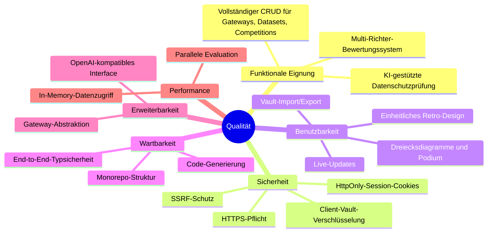

# 10. Qualitätsanforderungen

## 10.1 Übersicht der Qualitätsanforderungen

## 10.2 Qualitätsszenarien

| ID   | Qualitätsmerkmal | Szenario                                                                                                     | Erwartetes Ergebnis                                      |
|------|------------------|--------------------------------------------------------------------------------------------------------------|----------------------------------------------------------|
| QS-1 | Erweiterbarkeit  | Ein neuer LLM-Anbieter mit beliebiger API (OpenAI-, Anthropic- oder Gemini-kompatibel) soll eingebunden werden | Nur Gateway-Konfiguration über UI nötig (Typ, URL, Custom Headers), kein Code-Change |
| QS-2 | Sicherheit       | Ein Benutzer versucht, eine Gateway-URL auf `http://169.254.169.254` zu setzen                                | System lehnt mit Fehlermeldung ab                         |
| QS-3 | Benutzbarkeit    | Ein Benutzer startet einen Wettbewerb mit 3 Teilnehmern und 3 Richtern                                       | Live-Statusanzeige; Ergebnisse nach Abschluss auf Podium  |
| QS-4 | Typsicherheit    | Ein Entwickler ändert die OpenAPI-Spec und generiert den Client neu                                           | TypeScript-Compilerfehler zeigen alle Anpassungsstellen    |
| QS-5 | Datenschutz      | Ein Datensatz mit personenbezogenen Daten wird hochgeladen                                                    | Privacy-Check erkennt PII; Anonymisierung ersetzt Daten    |
| QS-6 | Datensicherheit  | Der Server wird neu gestartet während ein Benutzer arbeitet                                                    | Vault-Daten bleiben im Browser erhalten; Re-Sync stellt Session wieder her |

---